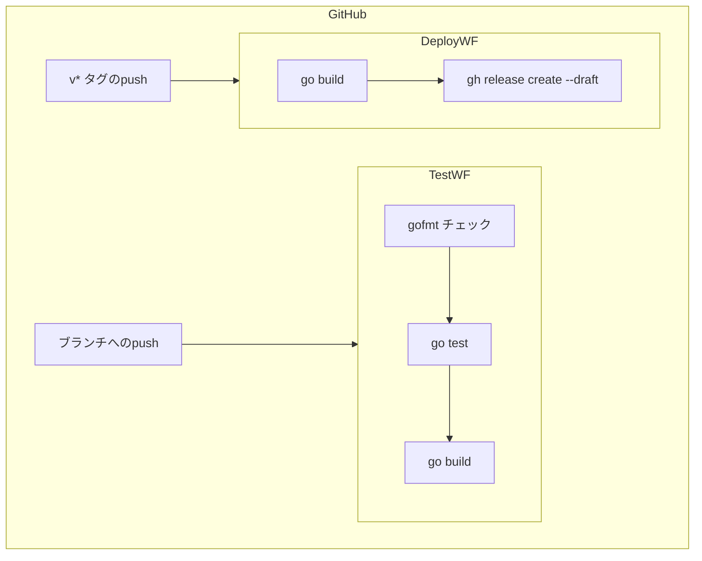
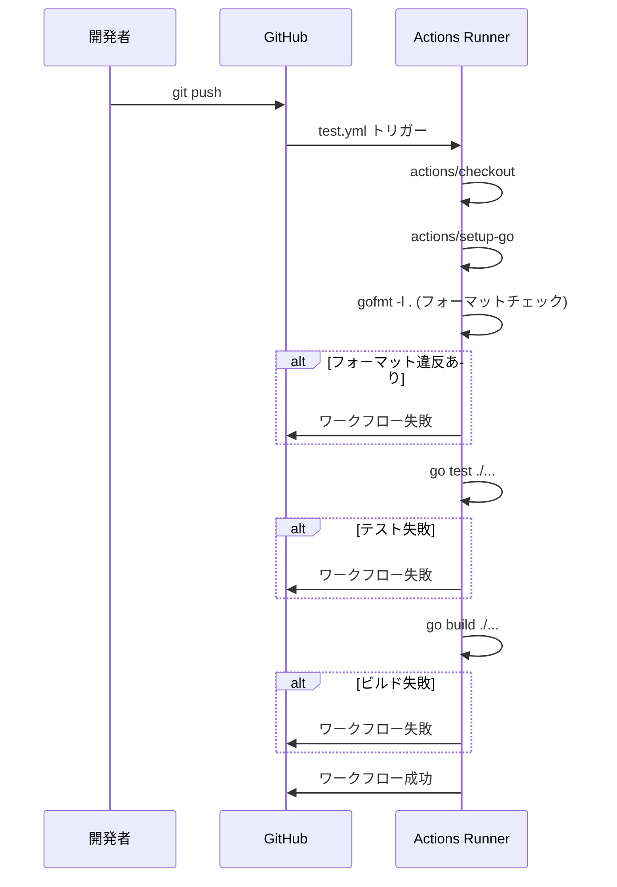
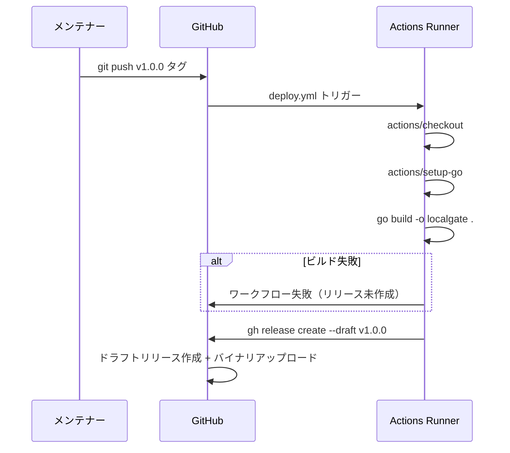

# Design Document: cicd-pipeline

## Overview

localgate（Go製動的リバースプロキシ）のCI/CDパイプラインをGitHub Actionsで構築する。コードの品質を継続的に担保する**テストパイプライン**と、バージョンタグを起点にリリース成果物を生成する**デプロイパイプライン**の2本のワークフローファイルを新規作成する。

**Purpose**: 開発者が手動作業なしに品質確認とリリース作成を自動化できるようにする。
**Users**: 開発者（テストパイプライン）、メンテナー（デプロイパイプライン）。
**Impact**: `.github/workflows/` に2つのYAMLファイルを追加する。既存コードへの変更はない。

### Goals
- pushのたびにフォーマット・テスト・ビルドを自動実行する
- バージョンタグのpushでドラフトリリースを自動生成する
- サードパーティアクションへの依存を最小化する

### Non-Goals
- クロスプラットフォーム向けバイナリのビルド（複数OS/アーキテクチャへのマトリクスビルド）
- リリースノートの自動生成
- コンテナイメージのビルド・プッシュ

## Architecture

### Architecture Pattern & Boundary Map

**Architecture Integration**:
- 選択パターン: 分離ワークフローファイル（テスト責務とデプロイ責務を分離）
- 既存パターン: Go標準ツールチェイン（`gofmt`, `go test`, `go build`）を活用
- 新規コンポーネント: `.github/workflows/test.yml`, `.github/workflows/deploy.yml`
- ステアリング準拠: Goの標準ライブラリ優先・シンプルさ優先の方針に従い、外部アクション依存を最小化

### Technology Stack

| Layer | Choice / Version | Role | Notes |
|-------|-----------------|------|-------|
| CI/CD Platform | GitHub Actions | ワークフロー実行基盤 | |
| Runtime | Go 1.22（go.mod準拠） | ビルド・テスト実行 | `go-version-file: 'go.mod'` で自動解決 |
| Setup Action | `actions/setup-go@v5` | Go環境のセットアップ | |
| Checkout Action | `actions/checkout@v4` | ソースコードのチェックアウト | |
| Release CLI | `gh` CLI（ubuntu-latest組み込み） | ドラフトリリース作成 | サードパーティアクション不要 |

## System Flows

### テストパイプライン実行フロー

### デプロイパイプライン実行フロー

## Requirements Traceability

| 要件 | 概要 | コンポーネント | フロー |
|------|------|--------------|--------|
| 1.1 | pushで3ステップを順次実行 | test.yml | テストパイプライン |
| 1.2 | フォーマット違反で失敗 | test.yml（gofmt ステップ） | テストパイプライン |
| 1.3 | テスト失敗でワークフロー失敗 | test.yml（go test ステップ） | テストパイプライン |
| 1.4 | ビルド失敗でワークフロー失敗 | test.yml（go build ステップ） | テストパイプライン |
| 1.5 | Go 1.22以上で実行 | test.yml（setup-go） | テストパイプライン |
| 2.1 | v* タグでデプロイ実行 | deploy.yml | デプロイパイプライン |
| 2.2 | バイナリをリリース成果物としてアップロード | deploy.yml（gh release create） | デプロイパイプライン |
| 2.3 | ドラフト状態でリリース作成 | deploy.yml（gh release create --draft） | デプロイパイプライン |
| 2.4 | タグ名をリリースタグとして使用 | deploy.yml（github.ref_name） | デプロイパイプライン |
| 2.5 | ビルド失敗時はリリース未作成 | deploy.yml（ステップ順序） | デプロイパイプライン |
| 2.6 | Go 1.22以上で実行 | deploy.yml（setup-go） | デプロイパイプライン |

## Components and Interfaces

### コンポーネント一覧

| Component | Domain | Intent | Req Coverage | Key Dependencies |
|-----------|--------|--------|-------------|-----------------|
| test.yml | CI | push時の品質チェック | 1.1〜1.5 | actions/checkout, actions/setup-go |
| deploy.yml | CD | タグpush時のリリース生成 | 2.1〜2.6 | actions/checkout, actions/setup-go, gh CLI |

### CI ワークフロー

#### test.yml

| Field | Detail |
|-------|--------|
| Intent | 全ブランチへのpushでフォーマット・テスト・ビルドを自動実行する |
| Requirements | 1.1, 1.2, 1.3, 1.4, 1.5 |

**Responsibilities & Constraints**
- トリガー: `on: push`（全ブランチ）
- ステップの実行順序: フォーマットチェック → テスト → ビルド（直列）
- いずれかのステップが失敗した場合は後続ステップを実行しない（GitHub Actionsのデフォルト動作）

**Dependencies**
- External: `actions/checkout@v4` — ソースコードチェックアウト（P0）
- External: `actions/setup-go@v5` — Go環境セットアップ（P0）

**Contracts**: Batch [x]

##### Batch / Job Contract
- Trigger: `on: push`（全ブランチへのpush）
- Goバージョン: `go-version-file: 'go.mod'`（go.mod の `go` ディレクティブを参照）
- フォーマットチェック: `test -z "$(gofmt -l .)"` — 出力が空でなければ `exit 1`
- テスト実行: `go test ./...`
- ビルド確認: `go build ./...`
- Idempotency: 各実行は独立したランナー環境で実行されるため冪等

**Implementation Notes**
- Integration: `.github/workflows/test.yml` として新規作成
- Validation: フォーマットチェックは `gofmt -l .` の標準出力が空かどうかで判定
- Risks: `go.mod` のGoバージョンと `actions/setup-go` の互換性。`go-version-file` を使用することで自動的に解決される

### CD ワークフロー

#### deploy.yml

| Field | Detail |
|-------|--------|
| Intent | `v*` タグpush時にバイナリをビルドしドラフトリリースを作成する |
| Requirements | 2.1, 2.2, 2.3, 2.4, 2.5, 2.6 |

**Responsibilities & Constraints**
- トリガー: `on: push: tags: ['v*']`
- ステップ順序: ビルド → リリース作成（直列。ビルド失敗時はリリース未作成）
- `permissions: contents: write` が必須（GitHub Releaseへの書き込みのため）
- バイナリ名: `localgate`（プロダクト名に準拠）

**Dependencies**
- External: `actions/checkout@v4` — ソースコードチェックアウト（P0）
- External: `actions/setup-go@v5` — Go環境セットアップ（P0）
- External: `gh` CLI — GitHub Releaseドラフト作成（P0、ubuntu-latestにプリインストール済み）

**Contracts**: Batch [x]

##### Batch / Job Contract
- Trigger: `on: push: tags: ['v*']`
- Goバージョン: `go-version-file: 'go.mod'`
- ビルドコマンド: `go build -o localgate .`
- リリース作成コマンド: `gh release create "${{ github.ref_name }}" localgate --draft --title "${{ github.ref_name }}"`
- 環境変数: `GH_TOKEN: ${{ secrets.GITHUB_TOKEN }}`
- Idempotency: 同一タグに対して再実行した場合は `gh release create` がエラーになるため、手動で既存リリースを削除する必要がある

**Implementation Notes**
- Integration: `.github/workflows/deploy.yml` として新規作成
- Validation: `go build` の終了コードで成功/失敗を判定（GitHub Actionsのデフォルト動作）
- Risks: 同一タグへの再pushで `gh release create` が失敗する可能性がある。ドラフト状態のため手動操作で対処可能

## Error Handling

### Error Strategy

GitHub Actionsのステップ失敗による自動的なワークフロー中断を基本戦略とする。明示的なエラーハンドリングコードは最小限に抑える。

### Error Categories and Responses

| エラー種別 | 発生箇所 | 対応 |
|-----------|---------|------|
| フォーマット違反 | test.yml: gofmt ステップ | exit 1 でステップ失敗 → ワークフロー中断 |
| テスト失敗 | test.yml: go test ステップ | 非ゼロ終了コード → ワークフロー中断 |
| ビルド失敗 | test.yml / deploy.yml: go build ステップ | 非ゼロ終了コード → ワークフロー中断 |
| 権限エラー | deploy.yml: gh release create | `permissions: contents: write` を明示設定で対応 |
| タグ重複 | deploy.yml: gh release create | 手動で既存ドラフトを削除して再実行 |

### Monitoring

GitHub ActionsのUIでワークフロー実行状況・ログを確認する。追加の監視設定は不要。

## Testing Strategy

### ワークフロー動作確認

- **テストパイプライン検証**:
  1. フォーマット違反コードをpushしてワークフローが失敗することを確認
  2. テスト失敗コードをpushしてワークフローが失敗することを確認
  3. 正常コードをpushしてワークフローが成功することを確認

- **デプロイパイプライン検証**:
  1. `v*` タグをpushしてワークフローがトリガーされることを確認
  2. GitHub Releasesにドラフト状態のリリースが作成されることを確認
  3. バイナリ `localgate` がリリース成果物として添付されていることを確認
  4. 通常のブランチpushではdeployワークフローがトリガーされないことを確認

## Security Considerations

- `GITHUB_TOKEN` はGitHub Actionsが自動生成するトークンを使用する（シークレット手動設定不要）
- `permissions: contents: write` はdeploy.ymlのジョブスコープに限定し、最小権限の原則に従う
- test.ymlには `permissions` 設定不要（デフォルトの読み取り権限で足りる）
