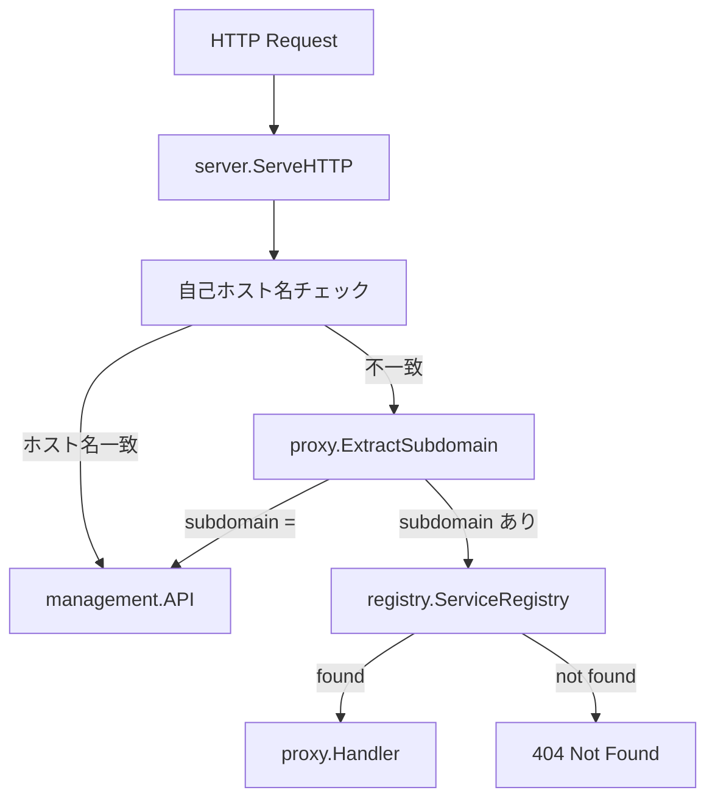
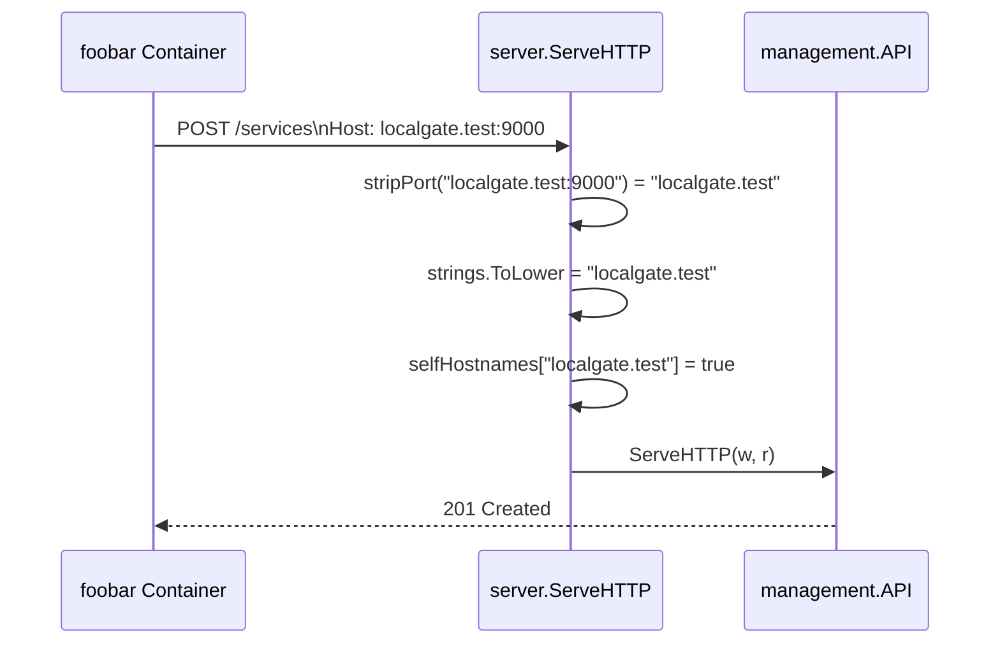
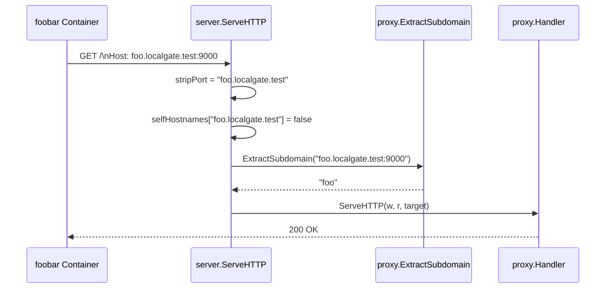

# 技術設計ドキュメント: container-environment-fix

## Overview

本フィーチャーは、コンテナ環境で localgate を使用する際の管理APIルーティングの誤判定を修正する。

**Purpose**: `localgate.test` のようなドット区切りホスト名でアクセスした場合に、先頭ラベルが誤ってプロキシのサブドメインと解釈される問題を解消し、管理APIへ正しくルーティングする。

**Users**: localgate をコンテナ環境にデプロイするインフラ担当者・開発者が、コンテナ内からサービスの登録・管理操作を正常に行えるようにする。

**Impact**: `server.ServeHTTP` のルーティング判定に自己ホスト名チェックを追加し、`ServerConfig` に `Hostname` フィールドを追加する。`cmd/start.go` に `--hostname` フラグを追加する。

### Goals

- `localgate.test:9000` 等の自己ホスト名でのアクセスを管理APIへ正しくルーティングする
- `localhost:9000` 経由のホストマシンからのアクセスを維持する（後方互換）
- `--hostname` フラグで追加の自己ホスト名を設定可能にする

### Non-Goals

- `proxy.ExtractSubdomain` の変更（変更不要と判明）
- 自己ホスト名の自動検出（OSのホスト名を読む等）
- 複数ホスト名の同時指定（`--hostname` は単一値）
- 永続化・設定ファイルによるホスト名管理

## Requirements Traceability

| Requirement | Summary | Components | Interfaces | Flows |
|-------------|---------|------------|------------|-------|
| 1.1 | 自己ホスト名へのリクエストを管理APIへルーティング | ProxyServer | `ServeHTTP` | 管理APIルーティングフロー |
| 1.2 | `<subdomain>.<自己ホスト名>` 形式をプロキシへルーティング | ProxyServer | `ServeHTTP`, `ExtractSubdomain` | プロキシルーティングフロー |
| 1.3 | 自己ホスト名に対する未知パスへ 404 を返す | management.API | `ServeHTTP` | — |
| 1.4 | `localhost` を常に管理APIホスト名として扱う | ProxyServer | `NewProxyServer` | — |
| 2.1 | `localhost` は設定不変の管理APIホスト名 | ProxyServer | `NewProxyServer` | — |
| 2.2 | `--hostname` フラグで追加の自己ホスト名を登録 | startCmd, ProxyServer | `ServerConfig.Hostname` | — |
| 2.3 | `--hostname` 未指定時は `localhost` のみ | startCmd | `--hostname` flag | — |
| 2.4 | ホスト名比較は大文字・小文字を区別しない | ProxyServer | `ServeHTTP` | — |
| 2.5 | ポート番号付き Host ヘッダからポートを除いて照合 | ProxyServer | `ServeHTTP` | — |
| 3.1 | `--hostname=localgate.test` 起動時に POST /services が動作 | ProxyServer, management.API | — | コンテナ環境フロー |
| 3.2 | `--hostname=localgate.test` 起動時に GET /services が動作 | ProxyServer, management.API | — | コンテナ環境フロー |
| 3.3 | `foobar.localgate.test` でプロキシが動作 | ProxyServer | `ExtractSubdomain` | プロキシルーティングフロー |
| 3.4 | 既存の `localhost` ベースのルーティングを変更しない | ProxyServer | — | — |

## Architecture

### Existing Architecture Analysis

現在の `server.ServeHTTP` ルーティングロジック:

```
Host ヘッダ
  └─ proxy.ExtractSubdomain(host)
       ├─ "" → management.API へ
       └─ "サブドメイン" → registry.Lookup → proxy.Handler へ
```

**問題点**: `ExtractSubdomain` はホスト名の先頭ラベルを無条件でサブドメインとして返す。`localgate.test` → `"localgate"` と解釈され、管理APIへ到達しない。

### Architecture Pattern & Boundary Map

変更は `internal/server` と `cmd` の2パッケージに限定される。



**Architecture Integration**:
- 既存パターン保持: `ExtractSubdomain` は変更しない。先頭ラベル抽出の責務はそのまま
- 新規チェック追加: 自己ホスト名セット (`selfHostnames map[string]struct{}`) を `ProxyServer` に追加し、`ExtractSubdomain` より前に評価
- Steering 準拠: コンストラクタパターン (`NewProxyServer`)、`sync.RWMutex` 不要（起動時に一度だけ初期化、以後読み取りのみ）

### Technology Stack

| Layer | Choice / Version | Role | Notes |
|-------|-----------------|------|-------|
| CLI | cobra v1.8 | `--hostname` フラグの追加 | 既存パターンに従う |
| Backend | Go 1.22+ 標準ライブラリ | ルーティング判定、ホスト名正規化 | `net.SplitHostPort`, `strings.ToLower` |

## System Flows

### 管理API ルーティングフロー（修正後）



### プロキシ ルーティングフロー（修正後）



## Components and Interfaces

### コンポーネントサマリー

| Component | Domain/Layer | Intent | Req Coverage | Key Dependencies | Contracts |
|-----------|-------------|--------|--------------|-----------------|-----------|
| ProxyServer | server | ルーティング判定に自己ホスト名チェックを追加 | 1.1, 1.2, 1.4, 2.1, 2.2, 2.4, 2.5, 3.4 | management.API, proxy.Handler, registry.ServiceRegistry | Service |
| startCmd | cmd | `--hostname` フラグを追加し ServerConfig へ渡す | 2.2, 2.3 | ProxyServer | — |

### server パッケージ

#### ProxyServer

| Field | Detail |
|-------|--------|
| Intent | Hostヘッダに基づき管理APIまたはプロキシへルーティングする |
| Requirements | 1.1, 1.2, 1.4, 2.1, 2.2, 2.4, 2.5, 3.1, 3.2, 3.3, 3.4 |

**Responsibilities & Constraints**
- 自己ホスト名セット (`selfHostnames`) の初期化と保持（起動時に一度のみ、以後不変）
- `ServeHTTP` での自己ホスト名チェック（`ExtractSubdomain` より前に評価）
- Hostヘッダのポート除去と小文字正規化

**Dependencies**
- Inbound: `cmd/start.go` — `ServerConfig` を受け取りインスタンス化 (P0)
- Outbound: `management.API` — 管理APIハンドラ (P0)
- Outbound: `proxy.Handler` — プロキシ転送 (P0)
- Outbound: `registry.ServiceRegistry` — サービス検索 (P0)
- Outbound: `proxy.ExtractSubdomain` — サブドメイン抽出（変更なし） (P0)

**Contracts**: Service [x]

##### Service Interface

```go
// ServerConfig はサーバ設定を保持する
type ServerConfig struct {
    Port     int
    Hostname string // 追加: 自己ホスト名（省略時は空文字列 ""）
}

// NewProxyServer は新しい ProxyServer を返す
// config.Hostname が空でない場合、selfHostnames に追加する
// "localhost" は常に selfHostnames に含まれる
func NewProxyServer(config ServerConfig, reg registry.ServiceRegistry) *ProxyServer

// ServeHTTP はリクエストをルーティングする
// 判定順序:
//   1. Hostヘッダからポートを除去し小文字に正規化
//   2. selfHostnames に一致する → management.API へ
//   3. proxy.ExtractSubdomain でサブドメイン抽出 → "" なら management.API へ
//   4. サブドメインあり → registry.Lookup → proxy.Handler または 404
func (s *ProxyServer) ServeHTTP(w http.ResponseWriter, r *http.Request)
```

- Preconditions: `r.Host` が空でないこと（空の場合は 400 Bad Request を返す）
- Postconditions: 管理APIまたはプロキシハンドラが呼び出される、またはエラーレスポンスを返す
- Invariants: `selfHostnames` は起動後に変更されない（読み取り専用）

**Implementation Notes**
- Integration: `net.SplitHostPort` でポートを除去。エラー（ポートなし）の場合は元の文字列をそのまま使用（既存 `ExtractSubdomain` と同じパターン）
- Validation: `selfHostnames` は `map[string]struct{}` で O(1) ルックアップ。キーはすべて `strings.ToLower` 済み
- Risks: なし（既存テストはゼロ値の `Hostname=""` で動作し続ける）

### cmd パッケージ

#### startCmd (`--hostname` フラグ追加)

| Field | Detail |
|-------|--------|
| Intent | `--hostname` フラグで追加の自己ホスト名を受け取り `ServerConfig` へ渡す |
| Requirements | 2.2, 2.3 |

**Responsibilities & Constraints**
- `--hostname` フラグの定義とデフォルト値（空文字列）
- 受け取った値を `ServerConfig.Hostname` に設定

**Implementation Notes**
- `startCmd.Flags().StringVar(&hostname, "hostname", "", "追加の自己ホスト名（管理APIとして扱うホスト名）")`
- `Hostname` が空文字列の場合、`NewProxyServer` 内で `localhost` のみが自己ホスト名となる（2.3 の要件を満たす）

## Error Handling

### Error Strategy

既存のエラー処理パターンを維持する。

### Error Categories and Responses

| 状況 | 対応 |
|------|------|
| Hostヘッダが空 | 400 Bad Request `{"error": "invalid host header"}` （既存動作維持） |
| 自己ホスト名に一致するが管理APIに未定義のパス | management.API が 404 を返す（1.3 対応） |
| プロキシ対象のサービスが未登録 | 404 Not Found `{"error": "service not found"}` （既存動作維持） |

### Monitoring

既存のログ出力パターンを変更しない。

## Testing Strategy

### Unit Tests

- `proxy.ExtractSubdomain` の既存テストに `localgate.test:9000` / `foo.localgate.test:9000` のケースを追加して動作を文書化（変更なしを確認）
- `NewProxyServer` の `selfHostnames` 初期化: `localhost` 常時挿入、`Hostname=""` の場合に `localhost` のみ、`Hostname="localgate.test"` の場合に2件

### Integration Tests（`server_test.go` への追加）

| テストケース | 対応要件 |
|-------------|---------|
| Host=`localgate.test:9000` → 管理APIへルーティング（POST /services が 201） | 1.1, 3.1 |
| Host=`localgate.test:9000` → 管理APIへルーティング（GET /services が 200） | 1.1, 3.2 |
| Host=`foo.localgate.test:9000` → 登録済みサービスにプロキシ | 1.2, 3.3 |
| Host=`localhost:9000` → 管理APIへルーティング（後方互換） | 1.4, 3.4 |
| Host=`foo.localhost:9000` → プロキシ（後方互換） | 3.4 |
| `--hostname` 未指定時、`localgate.test` は管理APIへルーティングされない | 2.3 |

### テスト用ヘルパー

```go
// --hostname 指定時のテストサーバ生成
func newTestServerWithHostname(hostname string) (*httptest.Server, registry.ServiceRegistry) {
    reg := registry.NewServiceRegistry()
    srv := server.NewProxyServer(server.ServerConfig{Port: 0, Hostname: hostname}, reg)
    return httptest.NewServer(srv), reg
}
```
