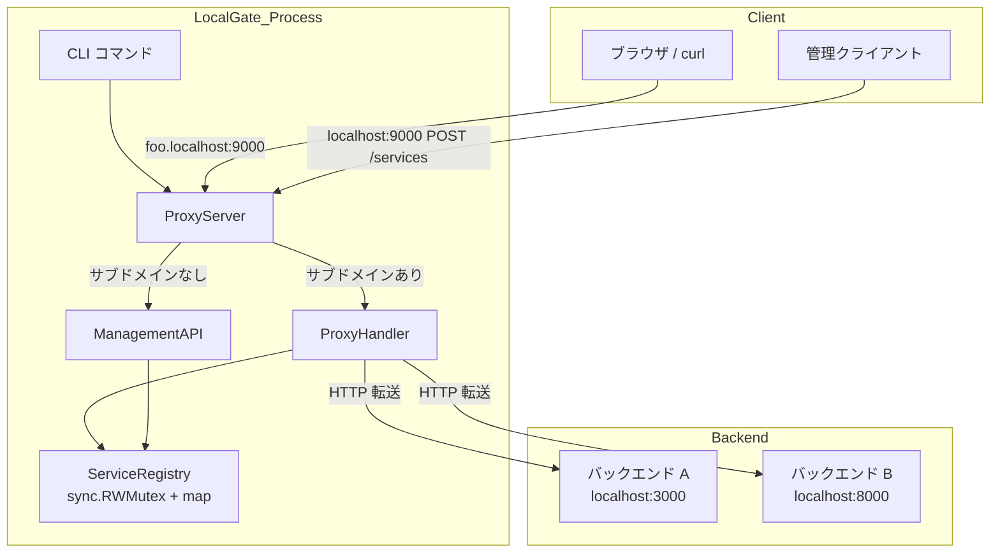
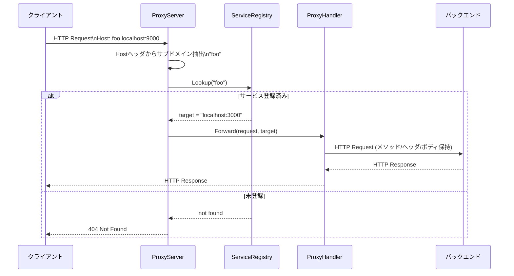
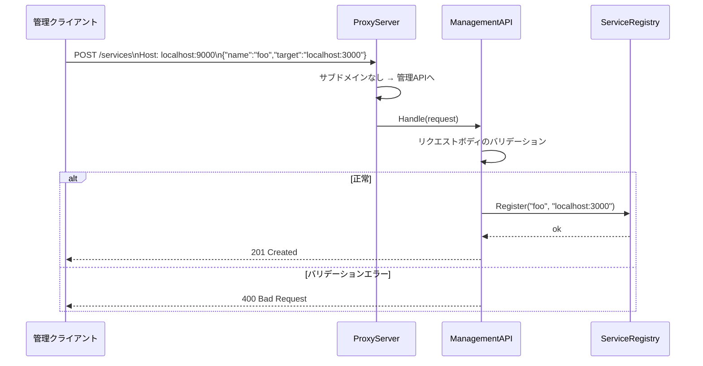

# Design Document — dynamic-proxy

## Overview

LocalGate は、ローカル開発環境および内部ネットワーク上の複数HTTPサービスを、サブドメインベースのルーティングにより単一エンドポイントから利用可能にするリバースプロキシCLIツールである。

**Purpose**: 開発者が `localgate start` 一コマンドでプロキシを起動し、HTTP APIでバックエンドサービスを動的に登録・解除できる環境を提供する。
**Users**: ローカル開発者が複数のマイクロサービスやコンテナ環境のサービスを、`*.localhost` サブドメインで識別しながら利用する。
**Impact**: 単一ポートで複数サービスを識別・転送できるため、ポート番号を意識せずにサービスアクセスが可能になる。

### Goals

- `localgate start` による単一コマンド起動
- Hostヘッダのサブドメインに基づくリバースプロキシ転送
- 再起動不要のHTTP API（登録・解除・一覧）

### Non-Goals

- HTTPS/TLS 対応（ローカル開発用途のためHTTPのみ）
- ルーティングテーブルの永続化（プロセス再起動でリセット）
- 認証・認可機能
- ロードバランシング（1サブドメイン：1ターゲット）

---

## Requirements Traceability

| 要件 | 概要 | コンポーネント | インターフェース | フロー |
|------|------|---------------|----------------|--------|
| 1.1 | 指定ポートでHTTPサーバ待ち受け | ProxyServer | ServerConfig | 起動フロー |
| 1.2 | localgate start で起動 | CLI | — | 起動フロー |
| 1.3 | HTTPリクエスト受信 | ProxyServer | — | プロキシフロー |
| 2.1 | Hostヘッダからサブドメイン抽出 | ProxyServer | SubdomainExtractor | プロキシフロー |
| 2.2 | 対応バックエンドへ転送 | ProxyHandler | — | プロキシフロー |
| 2.3〜2.5 | メソッド・ヘッダ・ボディ保持 | ProxyHandler | — | プロキシフロー |
| 2.6 | バックエンドのレスポンスをクライアントへ返す | ProxyHandler | — | プロキシフロー |
| 3.1〜3.4 | サービス登録API | ManagementAPI, ServiceRegistry | RegisterServiceRequest | 登録フロー |
| 4.1〜4.3 | サービス解除API | ManagementAPI, ServiceRegistry | — | — |
| 5.1〜5.2 | サービス一覧API | ManagementAPI, ServiceRegistry | ServiceEntry | — |
| 6.1〜6.2 | 未登録サービスへの404返却 | ProxyServer, ProxyHandler | — | プロキシフロー |
| 7.1〜7.2 | 動的設定（再起動不要） | ServiceRegistry | — | — |
| 8.1〜8.2 | 単一コマンド起動・単一プロセス | CLI | — | 起動フロー |

---

## Architecture

### Architecture Pattern & Boundary Map

シンプルなレイヤードアーキテクチャを採用する。単一プロセス内に CLI、HTTPサーバ、サービスレジストリの3層を持つ。



**Architecture Integration**:
- 選択パターン: レイヤードアーキテクチャ（シングルプロセス）— ローカル開発ツールとして最小構成を優先
- ドメイン境界: CLI（起動）／ProxyServer（ルーティング判定）／ServiceRegistry（データ管理）／ProxyHandler（転送）
- 単一ポートで管理API・プロキシ共存: Hostヘッダにサブドメインがあればプロキシ、なければ管理APIへルーティング

### Technology Stack

| レイヤー | 選択 / バージョン | 役割 | 備考 |
|---------|-----------------|------|------|
| CLI | Go + cobra v1.8 | `localgate start` サブコマンド | 将来のサブコマンド拡張に対応 |
| HTTP Server | Go net/http（標準ライブラリ） | リクエスト受信・ルーティング判定 | 外部依存なし |
| Reverse Proxy | net/http/httputil.ReverseProxy | バックエンドへのリクエスト転送 | Go 標準実装 |
| Service Registry | インメモリ map + sync.RWMutex | ルーティングテーブル管理 | 永続化なし（要件外）|
| Infrastructure | Go 1.21+ / 単一バイナリ | 実行環境 | クロスコンパイル可能 |

---

## System Flows

### プロキシリクエストフロー



### サービス登録フロー



---

## Components and Interfaces

### コンポーネント概要

| コンポーネント | レイヤー | 役割 | 要件カバレッジ | 主要依存 | コントラクト |
|--------------|---------|------|--------------|---------|------------|
| CLI | エントリポイント | コマンド解析・起動 | 1.2, 8.1, 8.2 | ProxyServer (P0) | Service |
| ProxyServer | HTTP | 受信・ルーティング判定 | 1.1, 1.3, 2.1, 6.1, 6.2 | ServiceRegistry (P0), ProxyHandler (P0), ManagementAPI (P0) | Service |
| ServiceRegistry | ドメイン | ルーティングテーブル管理 | 3.1〜3.4, 4.1〜4.3, 5.1〜5.2, 7.1〜7.2 | — | Service, State |
| ProxyHandler | HTTP | リバースプロキシ転送 | 2.2〜2.6 | ServiceRegistry (P0) | Service |
| ManagementAPI | HTTP | 登録・解除・一覧API | 3.1〜3.4, 4.1〜4.3, 5.1〜5.2 | ServiceRegistry (P0) | API |

---

### CLI レイヤー

#### CLI

| フィールド | 詳細 |
|----------|------|
| Intent | `localgate start` コマンドを解析し、ProxyServer を起動する |
| Requirements | 1.2, 8.1, 8.2 |

**Responsibilities & Constraints**
- `start` サブコマンドのフラグ（`--port`）を解析する
- ProxyServer を初期化して起動する
- プロセスのシグナル（SIGINT/SIGTERM）を受け取り、グレースフルシャットダウンを行う

**Dependencies**
- Outbound: ProxyServer — 起動制御 (P0)
- External: cobra v1.8 — CLIフレームワーク (P1)

**Contracts**: Service [x]

##### Service Interface（Go）

```go
// Entrypoint — cobra コマンド定義
var startCmd = &cobra.Command{
    Use:   "start",
    Short: "プロキシサーバを起動する",
    RunE:  runStart,
}

type ServerConfig struct {
    Port int // デフォルト: 9000
}
```

**Implementation Notes**
- Integration: `cobra.Command.RunE` 内で `ProxyServer.Start(config)` を呼び出す
- Validation: `--port` は 1〜65535 の範囲を検証する
- Risks: なし

---

### HTTP レイヤー

#### ProxyServer

| フィールド | 詳細 |
|----------|------|
| Intent | HTTPリクエストを受信し、サブドメインの有無でプロキシ/管理APIへルーティングする |
| Requirements | 1.1, 1.3, 2.1, 6.1, 6.2 |

**Responsibilities & Constraints**
- 指定ポートで `http.Server` を起動する
- Hostヘッダからサブドメインを抽出し、存在すれば ProxyHandler へ、なければ ManagementAPI へ委譲する
- Hostヘッダが不正または空の場合は 400 を返す

**Dependencies**
- Inbound: CLI — 起動制御 (P0)
- Outbound: ProxyHandler — プロキシ転送 (P0)
- Outbound: ManagementAPI — 管理リクエスト処理 (P0)
- Outbound: ServiceRegistry — サブドメイン存在確認 (P0)

**Contracts**: Service [x]

##### Service Interface（Go）

```go
type ProxyServer struct {
    registry   ServiceRegistry
    proxy      ProxyHandler
    management ManagementAPI
    httpServer *http.Server
}

func NewProxyServer(config ServerConfig, registry ServiceRegistry) *ProxyServer

func (s *ProxyServer) Start() error
func (s *ProxyServer) Shutdown(ctx context.Context) error

// サブドメイン抽出（内部ユーティリティ）
// Host: "foo.localhost:9000" → "foo"
// Host: "localhost:9000"     → "" (管理API)
func extractSubdomain(host string) string
```

- Preconditions: `config.Port` が有効な範囲であること
- Postconditions: `Start()` 呼び出し後はポートで待ち受け開始
- Invariants: サブドメイン抽出ロジックは副作用なし

**Implementation Notes**
- Integration: `http.ServeMux` または単一 `ServeHTTP` でルーティング
- Validation: `extractSubdomain` はポート番号除去後にドットで分割してサブドメインを判定
- Risks: `*.localhost` 以外のHostヘッダが来た場合の扱いは 400 で統一

---

#### ProxyHandler

| フィールド | 詳細 |
|----------|------|
| Intent | バックエンドサービスへHTTPリクエストを転送し、レスポンスをクライアントへ返す |
| Requirements | 2.2, 2.3, 2.4, 2.5, 2.6 |

**Responsibilities & Constraints**
- `httputil.ReverseProxy` を用いてリクエスト転送
- HTTPメソッド、ヘッダ、ボディを保持して転送する
- バックエンド接続失敗時は 502 を返す

**Dependencies**
- Inbound: ProxyServer — 転送委譲 (P0)
- Outbound: バックエンドサービス — HTTP転送 (P0)
- External: net/http/httputil.ReverseProxy — Go 標準ライブラリ (P0)

**Contracts**: Service [x]

##### Service Interface（Go）

```go
type ProxyHandler interface {
    ServeHTTP(w http.ResponseWriter, r *http.Request, target string)
}

type reverseProxyHandler struct{}

func NewProxyHandler() ProxyHandler

// target: "localhost:3000" 形式のバックエンドアドレス
func (h *reverseProxyHandler) ServeHTTP(w http.ResponseWriter, r *http.Request, target string)
```

**Implementation Notes**
- Integration: `httputil.NewSingleHostReverseProxy` でターゲットURLを構築
- Validation: `target` が空の場合は呼び出し元（ProxyServer）がガードする
- Risks: バックエンドがダウンしている場合 → `ErrorHandler` で 502 Bad Gateway を返す

---

### ドメイン レイヤー

#### ServiceRegistry

| フィールド | 詳細 |
|----------|------|
| Intent | サブドメインとバックエンドアドレスのマッピングをスレッドセーフに管理する |
| Requirements | 3.1〜3.4, 4.1〜4.3, 5.1〜5.2, 7.1〜7.2 |

**Responsibilities & Constraints**
- `map[string]string`（key: サブドメイン, value: ターゲットアドレス）をインメモリで保持する
- 読み取りは複数ゴルーチンが並行実行可能（`sync.RWMutex`）
- 書き込みは排他的に実行する
- 同一 `name` の再登録は上書き更新

**Dependencies**
- Inbound: ProxyServer, ManagementAPI — ルーティング参照・更新 (P0)

**Contracts**: Service [x] / State [x]

##### Service Interface（Go）

```go
type ServiceEntry struct {
    Name   string `json:"name"`
    Target string `json:"target"`
}

type ServiceRegistry interface {
    Register(name, target string) error
    Deregister(name string) error
    Lookup(name string) (target string, found bool)
    List() []ServiceEntry
}

type inMemoryRegistry struct {
    mu       sync.RWMutex
    services map[string]string
}

func NewServiceRegistry() ServiceRegistry
```

- Preconditions: `name` および `target` は空文字でないこと
- Postconditions: `Register` 後に `Lookup(name)` は登録した `target` を返す
- Invariants: `sync.RWMutex` により並行アクセス安全性を保証

##### State Management

- State model: `map[string]string` — key はサブドメイン名、value はバックエンドアドレス
- Persistence & consistency: インメモリのみ。プロセス再起動でリセット（永続化は要件外）
- Concurrency strategy: `sync.RWMutex` — 読み取り並行、書き込み排他

---

### ManagementAPI

| フィールド | 詳細 |
|----------|------|
| Intent | HTTP API（登録・解除・一覧）のリクエストを処理し、ServiceRegistry を更新・参照する |
| Requirements | 3.1〜3.4, 4.1〜4.3, 5.1〜5.2 |

**Responsibilities & Constraints**
- `POST /services`、`DELETE /services/{name}`、`GET /services` を処理する
- リクエストボディを JSON でパースし、必須フィールドを検証する
- ServiceRegistry の変更はプロキシの再起動なしに即時反映される

**Dependencies**
- Inbound: ProxyServer — リクエスト委譲 (P0)
- Outbound: ServiceRegistry — 登録・解除・一覧 (P0)

**Contracts**: API [x]

##### API Contract

| Method | Endpoint | Request Body | Response | Errors |
|--------|----------|-------------|----------|--------|
| POST | /services | `RegisterServiceRequest` | `ServiceEntry` (201) | 400 (バリデーション失敗) |
| DELETE | /services/{name} | — | 204 No Content | 404 (未登録) |
| GET | /services | — | `[]ServiceEntry` (200) | — |

##### Request / Response Schemas（Go）

```go
// POST /services リクエストボディ
type RegisterServiceRequest struct {
    Name   string `json:"name"`   // 必須: サブドメイン名（空文字不可）
    Target string `json:"target"` // 必須: バックエンドアドレス（空文字不可）
}

// GET /services レスポンス
type ListServicesResponse struct {
    Services []ServiceEntry `json:"services"`
}
```

**Implementation Notes**
- Integration: `http.ServeMux` でパスとメソッドを組み合わせてハンドラを登録
- Validation: `name` と `target` が空文字の場合は 400 を返す。JSONパース失敗時も 400
- Risks: Go 1.22 以降の `ServeMux` は `{name}` パスパラメータを標準サポート（1.21 以前は手動パース）

---

## Data Models

### Domain Model

- **Aggregate Root**: `ServiceEntry` — `name`（サブドメイン）を識別子とする
- **Entities**: `ServiceEntry { Name string, Target string }`
- **Invariants**:
  - `Name` は空文字不可、英数字とハイフンのみ
  - `Target` は `host:port` 形式
  - `Name` は一意（重複登録は上書き）

### Logical Data Model

```
ServiceRegistry (インメモリ)
  key:   name   (string) — サブドメイン識別子、一意
  value: target (string) — バックエンドアドレス "host:port"
```

- カーディナリティ: 1 name : 1 target
- 自然キー: `name`

### Data Contracts & Integration

**API Data Transfer**
- シリアライズ形式: JSON
- Content-Type: `application/json`
- バリデーション: `name` と `target` の非空チェックを ManagementAPI でアプリケーション層バリデーションとして実施

---

## Error Handling

### Error Strategy

- ユーザーエラー（4xx）: 早期検証でクライアントへ明確なメッセージを返す
- システムエラー（5xx）: バックエンド接続失敗を 502 で通知し、LocalGate プロセス自体は継続稼働

### Error Categories and Responses

| カテゴリ | 条件 | HTTPステータス | ボディ |
|---------|------|-------------|--------|
| 未登録サービス | サブドメインが未登録 | 404 Not Found | `{"error": "service not found"}` |
| Hostヘッダ不正 | Hostヘッダなし・サブドメイン不正 | 400 Bad Request | `{"error": "invalid host header"}` |
| バリデーション失敗 | name/target が空 | 400 Bad Request | `{"error": "name and target are required"}` |
| JSON パース失敗 | リクエストボディ不正 | 400 Bad Request | `{"error": "invalid request body"}` |
| 登録名未存在（DELETE） | 削除対象が未登録 | 404 Not Found | `{"error": "service not found"}` |
| バックエンド接続失敗 | バックエンドがダウン | 502 Bad Gateway | `{"error": "backend unavailable"}` |

### Monitoring

- ログ: 起動時ポート番号、各リクエストのメソッド・Host・ステータスコードを標準出力へ出力
- ヘルスチェック: `GET /` （管理API）で登録サービス一覧を返すことで簡易的なヘルス確認が可能

---

## Testing Strategy

### Unit Tests

1. `extractSubdomain` — 各種Hostヘッダ形式のサブドメイン抽出
2. `ServiceRegistry.Register / Lookup / Deregister / List` — 正常系・エラー系・並行アクセス
3. `ManagementAPI` ハンドラ — 各エンドポイントの入力バリデーション・レスポンス形式
4. `RegisterServiceRequest` バリデーション — 必須フィールド欠落

### Integration Tests

1. `POST /services` → `GET /services` でサービスが一覧に現れる
2. `foo.localhost:9000` へのリクエストが登録済みバックエンドへ転送される
3. `DELETE /services/foo` 後に `foo.localhost:9000` が 404 を返す
4. 未登録サブドメインへのアクセスが 404 を返す
5. バックエンドダウン時に 502 を返す

### Performance / Load（ローカル開発用途として最小限）

1. ルーティングテーブル 100 件登録時の Lookup レイテンシが 1ms 未満
2. 同時 100 リクエストでのルーティングテーブル並行アクセスにデータ競合なし

---

## Security Considerations

- LocalGate はローカル開発用途を前提とする。ネットワーク境界での認証・認可は実装しない。
- 管理APIはサブドメインなしの直接 `localhost:port` アクセスのみで到達可能であり、`*.localhost` へのアクセスはプロキシとして動作するため管理APIへは到達しない。
- `*.localhost` ドメインの DNS 設定はユーザーのローカル環境に委ねる（前提条件）。
