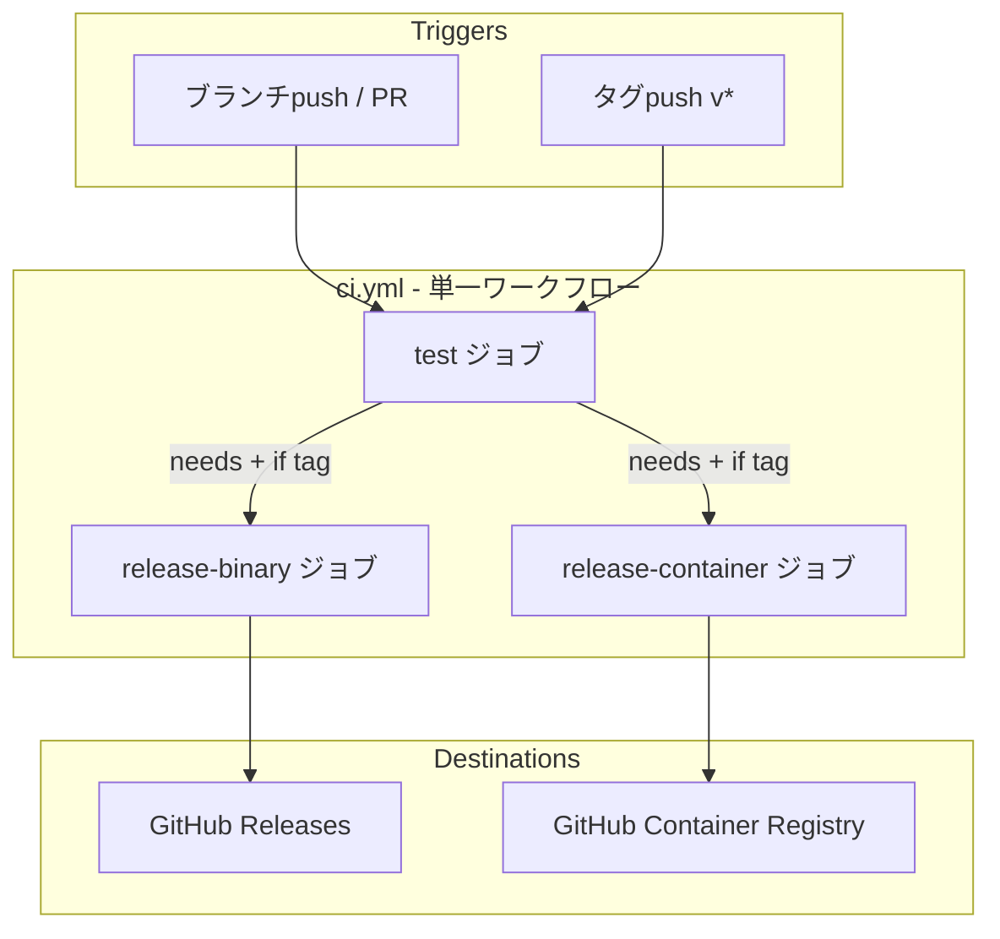
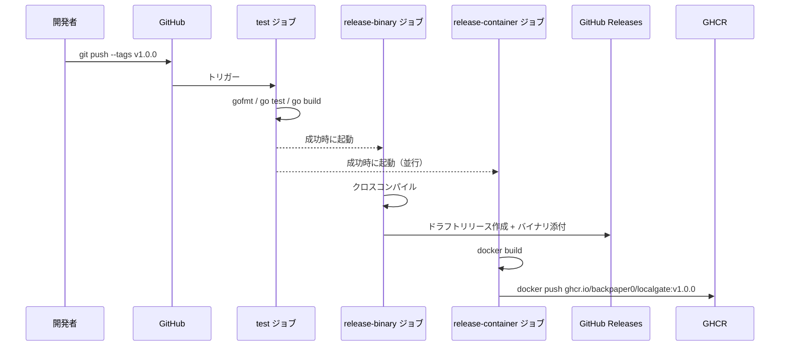
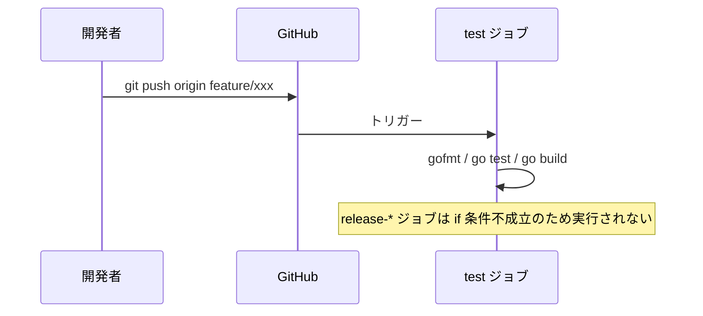

# Design Document: CI/CDパイプラインの改善

## Overview

本フィーチャーは、localgate プロジェクトの CI/CD パイプラインを改善し、タグpush時のテスト重複実行を解消するとともに、コンテナイメージのGHCR公開を実現する。

現在、`test.yml`（全pushで起動）と`deploy.yml`（タグpushで起動）が独立して存在するため、タグpush時に両ワークフローが並行実行され、テストが重複して行われる。これを単一の `ci.yml` ワークフローに統合し、ジョブ条件で制御することで問題を解消する。

**Users**: localgateを開発・メンテナンスする開発者、および Docker 経由で localgate を利用するエンドユーザー。

**Impact**: 既存の `test.yml`・`deploy.yml` を廃止し、単一の `ci.yml` へ置き換える。`Dockerfile` と `entrypoint.sh` を新規追加する。

### Goals

- タグpush時のテスト重複実行を解消する
- テスト完了後にデプロイジョブが実行される順序を保証する
- `ghcr.io/backpaper0/localgate` へのコンテナイメージ公開を実現する
- 既存のバイナリリリース機能を維持する

### Non-Goals

- マルチアーキテクチャコンテナビルド（linux/amd64 のみを初期スコープとする）
- コンテナイメージの脆弱性スキャン
- ローリングデプロイや Kubernetes 連携

## Architecture

### Existing Architecture Analysis

- **現行ワークフロー**:
  - `test.yml`: `on: push`（全push対象）→ gofmt・go test・go build
  - `deploy.yml`: `on: push: tags: v*` → クロスコンパイル → GitHub Release ドラフト
- **問題**: タグpush時、`test.yml` と `deploy.yml` が独立して並行実行される
- **変更方針**: 2ファイルを廃止し単一 `ci.yml` に統合

### Architecture Pattern & Boundary Map

- **選択パターン**: 単一ワークフロー + ジョブ条件（`if:` + `needs:`）
- **境界**: `test` ジョブがゲートとして機能し、失敗時はデプロイジョブが実行されない
- **並行実行**: `release-binary` と `release-container` は独立して並行実行される

### Technology Stack

| Layer | Choice / Version | Role | Notes |
|-------|-----------------|------|-------|
| CI/CDランタイム | GitHub Actions | ワークフロー実行基盤 | 既存 |
| コンテナビルド | docker/build-push-action v6 | イメージビルド・push | 新規 |
| GHCRログイン | docker/login-action v3 | GHCR認証 | 新規 |
| メタデータ生成 | docker/metadata-action v5 | イメージタグ・ラベル生成 | 新規 |
| コンテナランタイム | alpine:3 | 最小Goバイナリ実行環境 | 新規 |
| ビルドステージ | golang:1.22 | Goバイナリビルド | 新規（Dockerfile内） |

## System Flows

### タグpush時のフロー

### ブランチpush時のフロー

## Requirements Traceability

| Requirement | Summary | Components | Interfaces | Flows |
|-------------|---------|------------|------------|-------|
| 1.1 | ブランチpush時はテストジョブのみ | test ジョブ | — | ブランチpushフロー |
| 1.2 | タグpush時はテスト→デプロイ順 | test + release-* ジョブ | `needs:` 依存 | タグpushフロー |
| 1.3 | 単一ワークフローで管理 | ci.yml | — | — |
| 1.4 | テスト失敗時はデプロイ非実行 | test ジョブ | `needs:` + GitHub Actions 自動制御 | — |
| 1.5 | 既存ワークフロー廃止 | ci.yml | — | — |
| 2.1 | gofmt チェック | test ジョブ | — | — |
| 2.2 | go test 実行 | test ジョブ | — | — |
| 2.3 | go build 確認 | test ジョブ | — | — |
| 3.1 | 5プラットフォーム クロスコンパイル | release-binary ジョブ | — | タグpushフロー |
| 3.2 | GitHub Releases ドラフト作成 | release-binary ジョブ | gh CLI | タグpushフロー |
| 3.3 | リリースタイトル = タグ名 | release-binary ジョブ | `github.ref_name` | — |
| 4.1 | GHCRへのイメージpush | release-container ジョブ | docker/build-push-action | タグpushフロー |
| 4.2 | バージョンタグ付与 | release-container ジョブ | docker/metadata-action | — |
| 4.3 | PORT 環境変数でポート変更 | Dockerfile + entrypoint.sh | — | — |
| 4.4 | --hostname でホスト名指定 | Dockerfile + entrypoint.sh | `localgate start --hostname` | — |
| 4.5 | デフォルト9000番ポート | entrypoint.sh | `${PORT:-9000}` | — |
| 4.6 | GITHUB_TOKEN で GHCR 認証 | release-container ジョブ | docker/login-action | — |

## Components and Interfaces

| Component | Layer | Intent | Req Coverage | Key Dependencies | Contracts |
|-----------|-------|--------|-------------|-----------------|-----------|
| ci.yml | CI/CD | 単一ワークフロー定義 | 1.1〜1.5 | GitHub Actions | Batch |
| test ジョブ | CI/CD | テスト・フォーマット・ビルド検証 | 2.1〜2.3 | actions/setup-go | Batch |
| release-binary ジョブ | CI/CD | バイナリクロスコンパイルとリリース | 3.1〜3.3 | gh CLI, GITHUB_TOKEN | Batch |
| release-container ジョブ | CI/CD | コンテナイメージビルドとGHCR公開 | 4.1, 4.2, 4.6 | docker/* actions | Batch |
| Dockerfile | コンテナ | マルチステージビルド定義 | 4.1〜4.5 | golang:1.22, alpine:3 | — |
| entrypoint.sh | コンテナ | 環境変数→CLIフラグ変換と起動 | 4.3〜4.5 | localgate バイナリ | — |

### CI/CDワークフロー層

#### ci.yml（統合ワークフロー）

| Field | Detail |
|-------|--------|
| Intent | 単一ワークフローファイルでテストとリリースを管理する |
| Requirements | 1.1, 1.2, 1.3, 1.4, 1.5 |

**Responsibilities & Constraints**
- `on: [push, pull_request]` でブランチpush・タグpush・PRを捕捉する
- `test` ジョブはすべてのトリガーで実行する
- `release-*` ジョブは `if: startsWith(github.ref, 'refs/tags/v')` 条件かつ `needs: [test]` でのみ実行する

**Dependencies**
- External: GitHub Actions ランナー — ワークフロー実行基盤 (P0)

**Contracts**: Batch [x]

##### Batch / Job Contract

- **Trigger**: `push`（ブランチ・タグ）および `pull_request`
- **ジョブ構成**:

  | ジョブ名 | 実行条件 | 依存 |
  |---------|---------|------|
  | `test` | 常時 | なし |
  | `release-binary` | `startsWith(github.ref, 'refs/tags/v')` | `test` |
  | `release-container` | `startsWith(github.ref, 'refs/tags/v')` | `test` |

- **Idempotency**: タグpushは通常1回限りのため冪等性は問題なし

**Implementation Notes**
- `test.yml` および `deploy.yml` を削除し `ci.yml` を新規作成する
- ブランチpush条件は明示的なフィルタ不要（`if` がタグ専用ジョブを制御するため）

---

#### test ジョブ

| Field | Detail |
|-------|--------|
| Intent | Goコードのフォーマット・テスト・ビルドを検証する |
| Requirements | 2.1, 2.2, 2.3 |

**Responsibilities & Constraints**
- `actions/setup-go@v5` で `go.mod` 指定のGoバージョンを使用する
- `test -z "$(gofmt -l .)"` でフォーマット違反を検出する
- `go test ./...` でユニットテストを実行する
- `go build ./...` でビルド可能性を確認する

**Dependencies**
- External: `actions/checkout@v4` (P0), `actions/setup-go@v5` (P0)

**Contracts**: Batch [x]

---

#### release-binary ジョブ

| Field | Detail |
|-------|--------|
| Intent | 5プラットフォーム向けバイナリをビルドしGitHub Releasesに公開する |
| Requirements | 3.1, 3.2, 3.3 |

**Responsibilities & Constraints**
- `permissions: contents: write` が必要
- `GOOS`/`GOARCH` 環境変数でクロスコンパイルする
- `gh release create` でドラフトリリースを作成する

**Dependencies**
- External: `actions/checkout@v4` (P0), `actions/setup-go@v5` (P0), `gh` CLI (P0)
- External: `GITHUB_TOKEN` シークレット (P0)

**Contracts**: Batch [x]

##### Batch / Job Contract

- **Trigger**: `needs: [test]` 完了後、`startsWith(github.ref, 'refs/tags/v')` 成立時
- **Input**: `github.ref_name`（タグ名、例: `v1.0.0`）
- **Output**: GitHub Releases ドラフト（タイトル = タグ名）に以下のバイナリを添付:
  - `localgate-linux-amd64`
  - `localgate-linux-arm64`
  - `localgate-darwin-amd64`
  - `localgate-darwin-arm64`
  - `localgate-windows-amd64.exe`
- **Idempotency**: 同一タグでの再実行は `gh release create` がエラーになるため手動削除が必要

---

#### release-container ジョブ

| Field | Detail |
|-------|--------|
| Intent | コンテナイメージをビルドしGHCRへpushする |
| Requirements | 4.1, 4.2, 4.6 |

**Responsibilities & Constraints**
- `permissions: packages: write` が必要
- `docker/login-action` で `ghcr.io` へ認証する
- `docker/metadata-action` でタグ（タグ名）とラベル（OCI標準）を生成する
- `docker/build-push-action` でビルドとpushを実行する

**Dependencies**
- External: `docker/login-action@v3` (P0)
- External: `docker/metadata-action@v5` (P0)
- External: `docker/build-push-action@v6` (P0)
- External: `GITHUB_TOKEN` シークレット (P0)

**Contracts**: Batch [x]

##### Batch / Job Contract

- **Trigger**: `needs: [test]` 完了後、`startsWith(github.ref, 'refs/tags/v')` 成立時
- **Input**: `github.ref_name`（タグ名）
- **Output**: `ghcr.io/backpaper0/localgate:v1.0.0` としてGHCRへpush
- **タグ戦略**: `docker/metadata-action` の `tags` セミバージョンタグを使用（`v1.0.0`, `v1.0`, `v1`, `latest`）
- **Idempotency**: 同一タグへの再pushは上書きとなる

---

### コンテナ定義層

#### Dockerfile

| Field | Detail |
|-------|--------|
| Intent | マルチステージビルドでlocalgateバイナリを含む最小コンテナイメージを定義する |
| Requirements | 4.1, 4.3, 4.4, 4.5 |

**Responsibilities & Constraints**
- Stage 1（builder）: `golang:1.22` でバイナリをビルドする（CGO無効、linux/amd64向け静的リンク）
- Stage 2（runtime）: `alpine:3` をベースに最小イメージを構成する
- `entrypoint.sh` をコピーして実行権限を付与する
- `EXPOSE 9000` でデフォルトポートをドキュメント化する

**Dependencies**
- External: `golang:1.22` Dockerイメージ (P0)
- External: `alpine:3` Dockerイメージ (P0)

**Contracts**: Batch [x]

##### Batch / Job Contract

- **ビルドステージ**:
  - `CGO_ENABLED=0 GOOS=linux go build -o localgate .` で静的バイナリを生成
- **ランタイムステージ**:
  - `COPY --from=builder /app/localgate /usr/local/bin/localgate`
  - `COPY entrypoint.sh /entrypoint.sh`
  - `ENTRYPOINT ["/entrypoint.sh"]`

---

#### entrypoint.sh

| Field | Detail |
|-------|--------|
| Intent | 環境変数をlocalgateの起動フラグに変換してプロセスを起動する |
| Requirements | 4.3, 4.4, 4.5 |

**Responsibilities & Constraints**
- `PORT` 環境変数を `--port` フラグに渡す（デフォルト: 9000）
- コンテナの `$HOSTNAME` 環境変数（Docker `--hostname` オプションで設定）を `--hostname` フラグに渡す
- `exec` でシグナル伝播を保証する

**Dependencies**
- Inbound: Docker エンジン — `PORT`, `HOSTNAME` 環境変数を注入 (P0)
- Outbound: `localgate` バイナリ — `start --port N --hostname S` で起動 (P0)

**Contracts**: Batch [x]

##### Batch / Job Contract

- **Trigger**: コンテナ起動
- **Input**:
  - `PORT` 環境変数（オプション、デフォルト9000）
  - `HOSTNAME` 環境変数（Docker `--hostname` により設定）
- **Output**: `localgate start --port ${PORT:-9000} --hostname "${HOSTNAME}"` を `exec` で実行
- **Idempotency**: コンテナ起動ごとに新規プロセスを開始する

**Implementation Notes**
- シェルスクリプトの1行目は `#!/bin/sh`
- `exec` を使用してPID 1としてlocalgateを実行し、シグナル（SIGTERM等）が正しく伝播されるようにする

## Error Handling

### Error Strategy

GitHub Actions ジョブの失敗は GitHub が自動的に後続ジョブをスキップする（`needs:` 依存により）。追加のエラーハンドリングは不要。

### Error Categories and Responses

| エラー種別 | 対応 |
|-----------|------|
| テスト失敗 | `test` ジョブが非0終了 → `release-*` ジョブは自動スキップ |
| GHCR認証失敗 | `docker/login-action` が非0終了 → ジョブ失敗、GitHub UI で確認 |
| ポート範囲外（1未満 or 65535超） | `localgate start` が起動時にエラーを返して終了 |

### Monitoring

- GitHub Actions の実行履歴でジョブの成否・ログを確認する
- GHCR の Packages ページでイメージの公開状態を確認する

## Testing Strategy

### ワークフロー動作確認

- **ブランチpushテスト**: `main` または任意のブランチへ push → `test` ジョブのみ実行、`release-*` ジョブが表示されないこと
- **タグpushテスト**: `v*` タグを push → `test` → `release-binary` + `release-container` の順で実行されること
- **テスト失敗時**: テストが失敗するコードを push → `release-*` ジョブが実行されないこと

### コンテナ動作確認

- **デフォルト起動**: `docker run -d -p 9000:9000 ghcr.io/backpaper0/localgate` → ポート9000で応答すること
- **ポート変更**: `docker run -d -p 9999:9999 -e PORT=9999 ghcr.io/backpaper0/localgate` → ポート9999で応答すること
- **ホスト名指定**: `docker run -d --hostname localgate.test ghcr.io/backpaper0/localgate` → `localgate.test` が管理APIホスト名として機能すること

## Security Considerations

- `GITHUB_TOKEN` はGitHub Actionsが自動的に提供するシークレットであり、外部シークレットの管理は不要
- `permissions` は必要最小限（`contents: write` はリリース作成のみ、`packages: write` はGHCR pushのみ）をジョブ単位で付与する
- コンテナは非rootユーザーでの実行を推奨するが、初期スコープには含めない（将来の改善項目）
