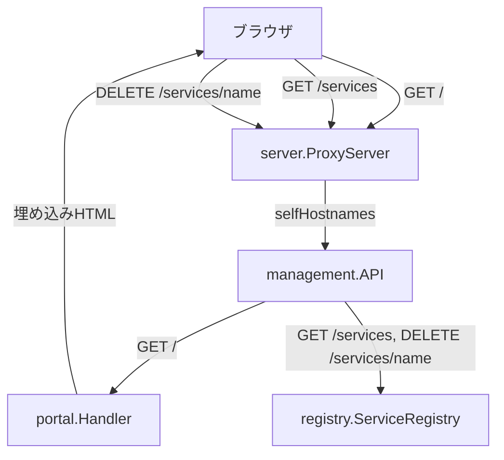
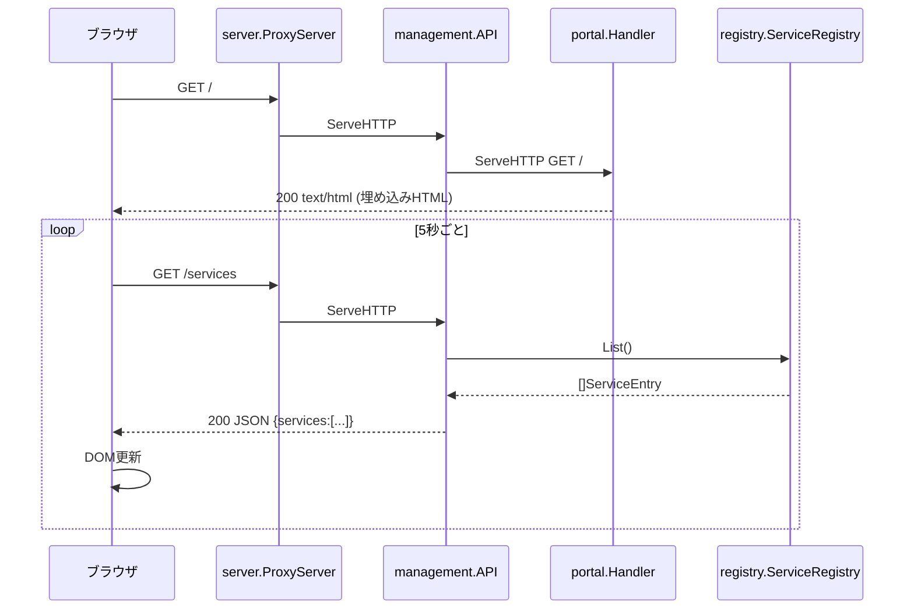
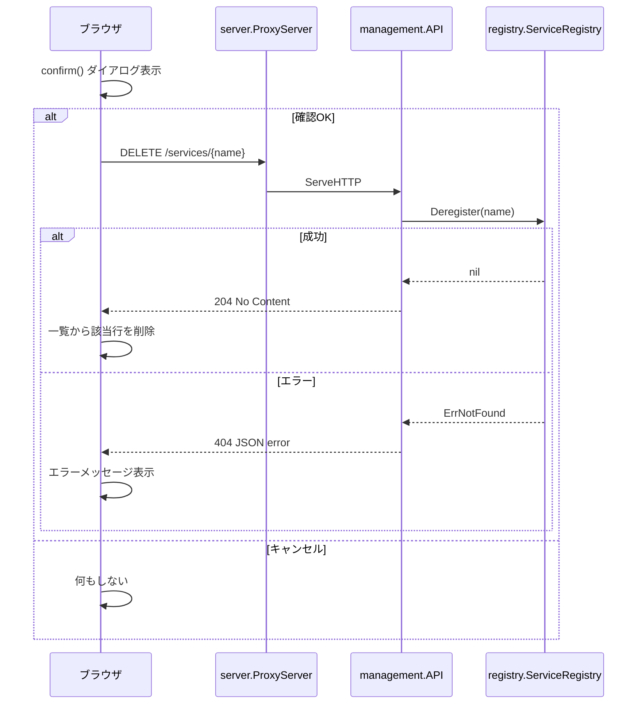

# Design Document: portal-screen

## Overview

ポータル画面機能は、`http://localhost:9000`（サブドメインなし）へのブラウザアクセスに対してHTMLページを配信し、localgate に登録済みのサービス一覧の確認・解除操作をウェブUIから行えるようにする。

**Purpose**: 開発者がブラウザから即座に現在のルーティング状態を確認・管理できる管理画面を提供する。
**Users**: ローカル開発者。CLIを使わずにサービス一覧の確認と解除を行いたいユーザー。
**Impact**: 現在404を返している `GET /` エンドポイントを、HTMLポータル画面に差し替える。既存の管理API（`/services`）はそのまま維持する。

### Goals

- `GET http://localhost:9000/` でHTMLポータルを返す（要件 1）
- 登録済みサービスの名前と接続先を一覧表示する（要件 2）
- 5秒ポーリングでサービス一覧をリアルタイム更新する（要件 3）
REVIEW: デフォルトは2秒間隔とし、`start`サブコマンドのパラメーターで任意の秒数を指定できるようにしてほしい。
- 各サービス行の解除ボタンで `DELETE /services/{name}` を呼び出す（要件 4）
- Tailwind CSS CDNを活用したモダンでかわいいUI（要件 5）

### Non-Goals

- サービスの新規登録（ポータルからのregisterは対象外。CLIから行う）
- Server-Sent Events / WebSocket によるプッシュ通知（将来の拡張）
- ユーザー認証・アクセス制限
- ポータルの永続的なデータ保存

---

## Architecture

### Existing Architecture Analysis

`internal/server/server.go` は `selfHostnames`（`localhost` 等）へのリクエストをすべて `management.API.ServeHTTP()` へ委譲する。`management.API` の内部 `http.ServeMux` に登録されたルートは以下のみ：

| Method | Path | Handler |
|--------|------|---------|
| POST | /services | handleRegister |
| DELETE | /services/{name} | handleDeregister |
| GET | /services | handleList |

`GET /` は未登録のため現在404が返る。

### Architecture Pattern & Boundary Map



**Architecture Integration**:
- 選択パターン: 既存管理APIへのルート追加（Extension）
- 新コンポーネント: `internal/portal.Handler` — HTML配信のみを担当する単一責務コンポーネント
- 既存パターン保持: `NewXxx()` コンストラクタ、`ServeHTTP()` インターフェース実装
- `management.API` が `portal.Handler` をインスタンス化し `GET /` に登録する

### Technology Stack

| Layer | Choice / Version | Role in Feature | Notes |
|-------|------------------|-----------------|-------|
| Backend | Go 1.22+, `net/http` | HTMLレスポンス配信 | 標準ライブラリのみ |
| 埋め込み | `embed` (Go 1.16+) | HTML をバイナリに静的埋め込み | 外部ファイル不要 |
| Frontend CSS | Tailwind CSS Play CDN | モダン・かわいいUIスタイリング | CDN経由。オフライン時は基本スタイルにフォールバック |
| Frontend JS | Vanilla JS (`fetch`, `setInterval`) | ポーリング・DOM更新・解除操作 | フレームワークなし |

---

## System Flows

### ポータル画面の初期表示とポーリング



### サービス解除フロー



---

## Requirements Traceability

| Requirement | Summary | Components | Interfaces | Flows |
|-------------|---------|------------|------------|-------|
| 1.1 | GET / でHTML返却 | portal.Handler | ServeHTTP | 初期表示 |
| 1.2 | HTTP 200 | portal.Handler | ServeHTTP | 初期表示 |
| 1.3 | 既存API動作維持 | management.API | mux | — |
| 2.1 | サービス名・接続先の一覧表示 | portal.Handler (HTML+JS) | GET /services | ポーリング |
| 2.2 | 空状態メッセージ | portal.Handler (HTML+JS) | — | — |
| 2.3 | GET /services JSON | management.API | handleList | ポーリング |
| 3.1 | 5秒ポーリング | portal.Handler (HTML+JS) | setInterval | ポーリング |
| 3.2 | DOMの差し替え更新 | portal.Handler (HTML+JS) | — | ポーリング |
| 3.3 | エラー時の継続リトライ | portal.Handler (HTML+JS) | — | — |
| 4.1 | 解除操作（confirm付き） | portal.Handler (HTML+JS) | DELETE /services/{name} | 解除フロー |
| 4.2 | 成功時にDOM削除 | portal.Handler (HTML+JS) | — | 解除フロー |
| 4.3 | 失敗時エラー表示 | portal.Handler (HTML+JS) | — | 解除フロー |
| 4.4 | 各行に解除ボタン | portal.Handler (HTML) | — | — |
| 5.1 | Tailwind CDN | portal.Handler (HTML) | — | — |
| 5.2 | 丸みカード・ボタン | portal.Handler (HTML) | — | — |
| 5.3 | パステル配色 | portal.Handler (HTML) | — | — |
| 5.4 | ヘッダーにロゴ | portal.Handler (HTML) | — | — |
| 5.5 | ホバーアニメーション | portal.Handler (HTML) | — | — |
| 5.6 | レスポンシブ | portal.Handler (HTML) | — | — |

---

## Components and Interfaces

### コンポーネント概要

| Component | Layer | Intent | Req Coverage | Key Dependencies | Contracts |
|-----------|-------|--------|--------------|------------------|-----------|
| portal.Handler | UI配信 | `GET /` にHTMLを返す | 1.1, 1.2, 2.1, 2.2, 3.1–3.3, 4.1–4.4, 5.1–5.6 | `embed` (P0) | API |
| management.API (変更) | API | `GET /` を portal.Handler に委譲 | 1.3 | portal.Handler (P0) | API |

---

### UI配信レイヤ

#### portal.Handler

| Field | Detail |
|-------|--------|
| Intent | `GET /` に対してHTMLを配信するハンドラ |
| Requirements | 1.1, 1.2, 2.1, 2.2, 3.1, 3.2, 3.3, 4.1, 4.2, 4.3, 4.4, 5.1, 5.2, 5.3, 5.4, 5.5, 5.6 |

**Responsibilities & Constraints**
- `portal.html` を `//go:embed` でバイナリに埋め込み、`GET /` リクエストに対して `text/html; charset=utf-8` で返す
- HTML/JS/CSS の全レンダリングロジックはクライアントサイドに委譲（サーバはHTMLを返すだけ）
- `portal.html` の JS が `GET /services` / `DELETE /services/{name}` を呼び出す

**Dependencies**
- Inbound: management.API — `GET /` ルートから呼び出される (P0)
- External: Tailwind CSS Play CDN — スタイリング (P1、オフライン時はフォールバックスタイルが機能)

**Contracts**: API [x]

##### API Contract

| Method | Endpoint | Request | Response | Errors |
|--------|----------|---------|----------|--------|
| GET | / | — | 200 text/html | — |

##### HTML内部 JavaScript API呼び出し

| Method | Endpoint | Purpose | 成功時 | 失敗時 |
|--------|----------|---------|--------|--------|
| GET | /services | サービス一覧取得 | DOMに一覧を描画 | エラーバナーを表示、次回リトライ |
| DELETE | /services/{name} | サービス解除 | 対象行をDOMから削除 | エラーメッセージを表示 |

**Implementation Notes**
- Integration: `management.NewAPI()` 内で `mux.HandleFunc("GET /", portal.NewHandler().ServeHTTP)` として登録する
- Validation: `portal.html` は `//go:embed portal.html` でコンパイル時に埋め込むため、ファイル不在はビルドエラーとして検出される
- Risks: Tailwind Play CDN はオフライン時に読み込まれない。HTML内に最小限のインラインスタイル（基本レイアウト用）をフォールバックとして含める

---

### 管理APIレイヤ（変更点）

#### management.API（GET / の追加）

| Field | Detail |
|-------|--------|
| Intent | 既存APIに `GET /` ルートを追加し portal.Handler へ委譲する |
| Requirements | 1.3 |

**Responsibilities & Constraints**
- `NewAPI()` 関数内の mux 登録に `mux.HandleFunc("GET /", portalHandler.ServeHTTP)` を1行追加
- 既存の `POST /services`, `DELETE /services/{name}`, `GET /services` ハンドラへの影響なし

**Dependencies**
- Inbound: server.ProxyServer (P0)
- Outbound: portal.Handler (P0), registry.ServiceRegistry (P0)

**Implementation Notes**
- `NewAPI(reg)` の引数変更は不要。`portal.NewHandler()` はレジストリ参照を持たない（データはクライアントJSがAPIを呼んで取得）

---

## Data Models

### Domain Model

ポータル画面はデータを永続化しない。表示データは `registry.ServiceEntry` を読み取るのみ。

```
ServiceEntry
  Name   string  // サービス名（サブドメイン）
  Target string  // 接続先URL
```

### Data Contracts & Integration

#### GET /services レスポンス（既存、変更なし）

```json
{
  "services": [
    { "name": "foo", "target": "http://localhost:3000" },
    { "name": "bar", "target": "http://localhost:4000" }
  ]
}
```

#### DELETE /services/{name} レスポンス（既存、変更なし）

- 成功: `204 No Content`
- 失敗: `404 {"error": "service not found"}`

---

## Error Handling

### Error Strategy

クライアントサイドのJSがAPIエラーをすべてキャッチし、UIにエラー状態を表示する。サーバ側のエラーハンドリングは既存実装を維持する。

### Error Categories and Responses

| 種別 | 原因 | UI挙動 |
|------|------|--------|
| ポーリング失敗 (5xx/ネットワーク) | サーバ停止・一時的障害 | エラーバナーを表示、次の5秒後に自動リトライ |
| 解除失敗 404 | 既に解除済み | エラーメッセージを表示（一覧はそのまま維持） |
| 解除失敗 5xx | サーバ内部エラー | エラーメッセージを表示 |

### Monitoring

ローカル開発ツールのため専用モニタリング不要。既存サーバログ（標準出力）に加え、クライアントJSの `console.error` でエラーを記録する。

---

## Testing Strategy

### Unit Tests

- `portal.Handler.ServeHTTP` がHTMLを返すことを検証（`Content-Type: text/html`, ステータス200）
- `portal.Handler.ServeHTTP` の埋め込みコンテンツが空でないことを検証

### Integration Tests

- `management.API` の mux に `GET /` が登録されており、HTMLレスポンスが返ることを検証
- `GET /services` が引き続きJSONを返すことを確認（既存テストの維持）
- `DELETE /services/{name}` が引き続き動作することを確認（既存テストの維持）

### E2E/UI Tests（手動確認）

- ブラウザで `http://localhost:9000` を開きポータルが表示されること
- 5秒後にサービス一覧が自動更新されること（別ターミナルからregisterして確認）
- 解除ボタンクリック → confirmダイアログ → OK → 一覧から消えること

---

## Security Considerations

ローカル開発ツールのため認証・認可は対象外。ただし以下に留意する。

- 解除ボタンのconfirmダイアログにより誤操作を防止（要件 4.1）
- HTMLテンプレートに動的ユーザー入力を埋め込まないため、XSSリスクはなし（サービス名はJSのDOM操作で挿入するためエスケープ処理を実装する）
