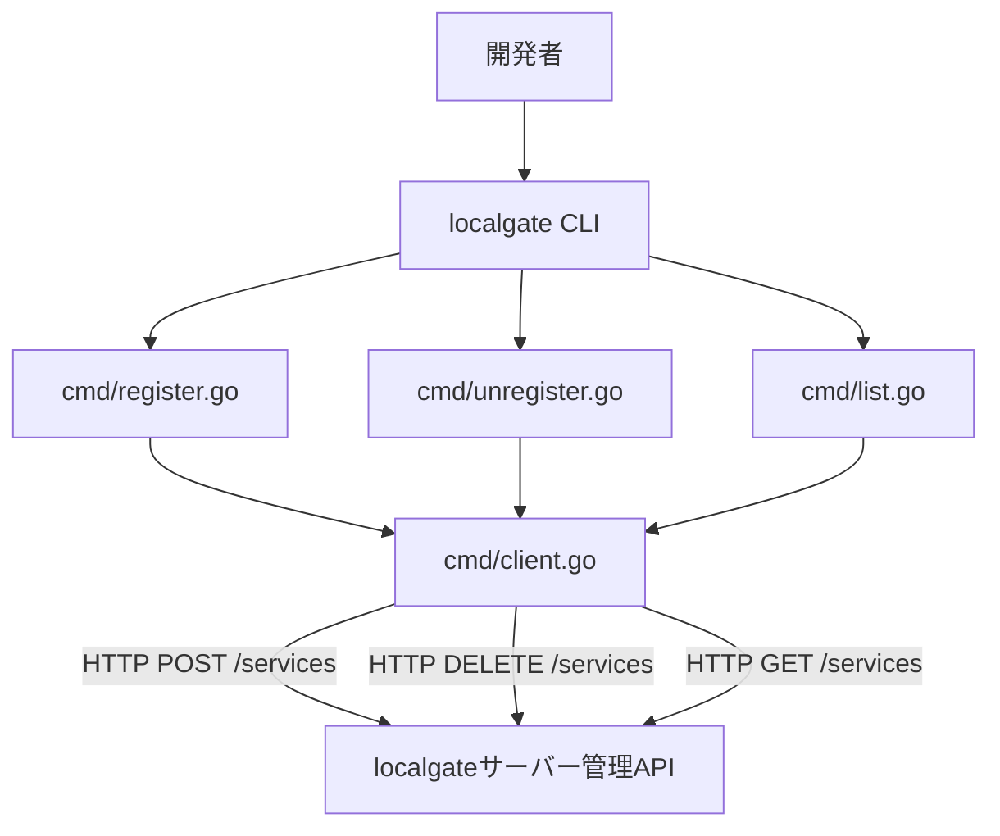
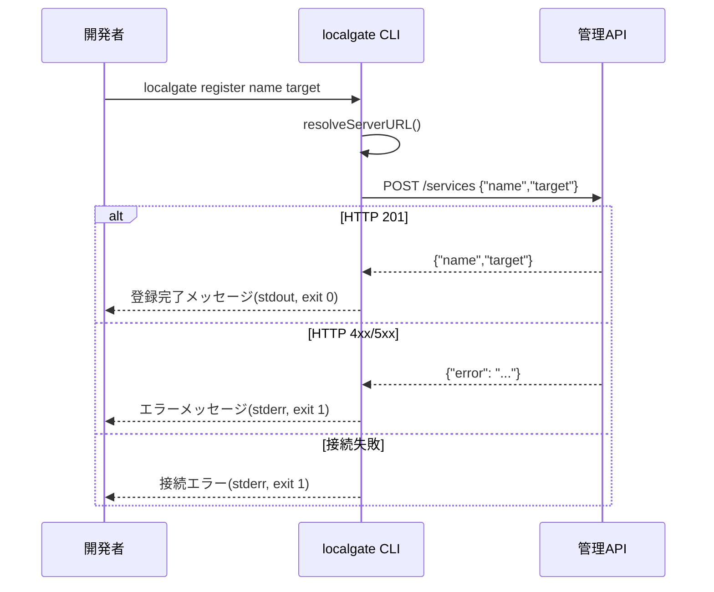
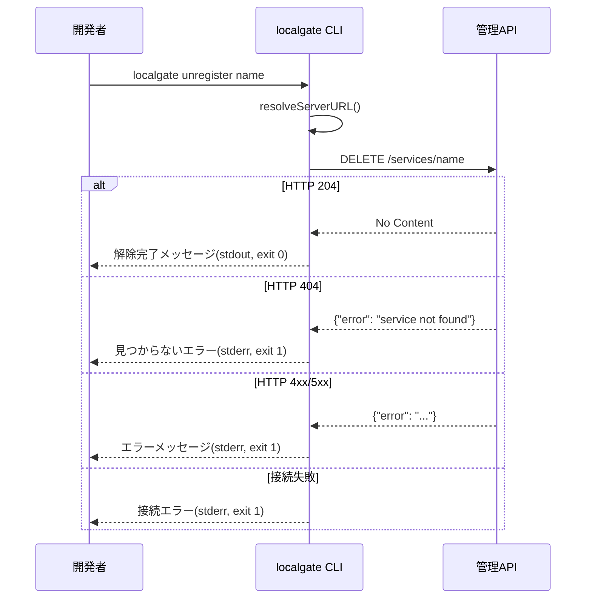

# Design Document: service-cli-management

## Overview

本機能は `localgate` CLIに `register`・`unregister`・`list` の3つのサブコマンドを追加し、開発者がコマンドラインから動的にサービスを管理できるようにする。

**Purpose**: localgateサーバーの管理HTTP APIをCLIから操作できるようにし、開発者のサービス管理ワークフローを効率化する。
**Users**: ローカル開発者がサービスの登録・解除・一覧確認を `localgate` コマンドから直接実行できる。
**Impact**: 既存の `localgate start` コマンドと並列して動作し、サーバー再起動なしで動的にサービスを管理できる。

### Goals

- `localgate register <name> <target>` でサービスを登録する
- `localgate unregister <name>` でサービスを解除する
- `localgate list` で登録済みサービスを一覧表示する
- `--server` フラグおよび `LOCALGATE_SERVER` 環境変数でサーバーURLを柔軟に指定できる

### Non-Goals

- サービス情報の永続化（インメモリレジストリはサーバー設計の責務）
- サービスの更新（update）操作
- インタラクティブなUI・TUI
- 認証・認可機能

## Requirements Traceability

| Requirement | Summary | Components | Interfaces | Flows |
|-------------|---------|------------|------------|-------|
| 1.1–1.5 | サービス登録コマンド | registerCmd, ManagementAPIClient | `POST /services` | registerフロー |
| 2.1–2.6 | サービス解除コマンド | unregisterCmd, ManagementAPIClient | `DELETE /services/{name}` | unregisterフロー |
| 3.1–3.5 | サービス一覧表示コマンド | listCmd, ManagementAPIClient | `GET /services` | listフロー |
| 4.1–4.5 | サーバーURL解決 | resolveServerURL（共有ヘルパー） | — | 全コマンド共通 |

## Architecture

### Existing Architecture Analysis

既存のCLIは cobra フレームワークを使い、1コマンド1ファイルのパターンを採用している（`cmd/start.go`）。管理HTTP APIは `internal/management` として実装済みで、localgateサーバープロセス内で動作する。新CLIコマンドはHTTPクライアントとして管理APIに接続する独立した操作であり、`internal/` パッケージをインポートしない。

### Architecture Pattern & Boundary Map



**Architecture Integration**:
- Selected pattern: 既存cobraコマンドの拡張。新ファイルを `cmd/` に追加し、`rootCmd` に登録
- Domain/feature boundaries: CLIレイヤー（`cmd/`）のみ変更。`internal/` は変更なし
- Existing patterns preserved: `init()` での `AddCommand`、`RunE` によるエラー返却、`fmt.Fprintf` による出力
- New components rationale: `cmd/client.go` はURL解決とHTTPリクエスト共通処理の重複排除のために新設
- Steering compliance: 標準ライブラリ優先（`net/http`）、cobra v1.8、Goコーディング規約準拠

### Technology Stack

| Layer | Choice / Version | Role | Notes |
|-------|-----------------|------|-------|
| CLI Framework | cobra v1.8 | コマンド定義・フラグ解析 | 既存依存 |
| HTTP Client | Go標準 `net/http` | 管理APIへのHTTPリクエスト | 新規依存なし |
| JSON | Go標準 `encoding/json` | リクエスト/レスポンスのシリアライズ | 新規依存なし |
| Runtime | Go 1.22+ | — | 既存 |

## System Flows

### サービス登録フロー



### サービス解除フロー



### サービス一覧フロー・サーバーURL解決

一覧取得フローは登録フローと同等（`GET /services` → 200 → 一覧表示）。URL解決は全コマンド共通で `--server` フラグ → `LOCALGATE_SERVER` 環境変数 → `http://localhost:9000` の順に評価する。

## Components and Interfaces

### コンポーネント概要

| Component | Domain/Layer | Intent | Req Coverage | Key Dependencies | Contracts |
|-----------|-------------|--------|-------------|-----------------|-----------|
| registerCmd | cmd/ | `register` サブコマンド | 1.1–1.5 | resolveServerURL (P0), net/http (P0) | API |
| unregisterCmd | cmd/ | `unregister` サブコマンド | 2.1–2.6 | resolveServerURL (P0), net/http (P0) | API |
| listCmd | cmd/ | `list` サブコマンド | 3.1–3.5 | resolveServerURL (P0), net/http (P0) | API |
| resolveServerURL | cmd/ (shared) | サーバーURL解決ヘルパー | 4.1–4.5 | os.Getenv (P0) | Service |

---

### cmd/ レイヤー

#### resolveServerURL（`cmd/client.go`）

| Field | Detail |
|-------|--------|
| Intent | `--server` フラグ、`LOCALGATE_SERVER` 環境変数、デフォルト値の優先順位でサーバーURLを解決する |
| Requirements | 4.1, 4.2, 4.3, 4.4, 4.5 |

**Responsibilities & Constraints**
- `flagValue` が空でない場合はその値を返す（フラグ最優先）
- `flagValue` が空で `LOCALGATE_SERVER` が設定されている場合は環境変数の値を返す
- どちらも未設定の場合は `http://localhost:9000` を返す
- URLのバリデーションは行わない（サーバーへの接続失敗で検出する）

**Dependencies**
- Inbound: registerCmd, unregisterCmd, listCmd — URL解決呼び出し (P0)
- External: `os.Getenv` — 環境変数読み取り (P0)

**Contracts**: Service [x]

##### Service Interface

```go
// resolveServerURL はサーバーURLを優先順位に従って解決する。
// 優先順位: flagValue > LOCALGATE_SERVER 環境変数 > "http://localhost:9000"
func resolveServerURL(flagValue string) string
```

- Preconditions: なし（空文字列は有効な入力）
- Postconditions: 必ず空でない文字列を返す
- Invariants: 返却値はフラグ値・環境変数値・デフォルト値のいずれか

---

#### registerCmd（`cmd/register.go`）

| Field | Detail |
|-------|--------|
| Intent | `localgate register <name> <target>` コマンドを実装し、管理APIの `POST /services` を呼び出す |
| Requirements | 1.1, 1.2, 1.3, 1.4, 1.5 |

**Responsibilities & Constraints**
- `<name>` と `<target>` の2引数を必須とする（cobra の `Args: cobra.ExactArgs(2)` で強制）
- `resolveServerURL` でサーバーURLを取得してHTTPリクエストを送信する
- 成功時（HTTP 201）: 登録完了メッセージを標準出力に表示、終了コード0
- エラー時（HTTP 4xx/5xx）: エラーメッセージを標準エラー出力に表示、終了コード1
- 接続失敗時: 接続エラーを標準エラー出力に表示、終了コード1

**Dependencies**
- Inbound: rootCmd — サブコマンドとして登録 (P0)
- Outbound: resolveServerURL — URL解決 (P0)
- External: `net/http`, `encoding/json` — HTTPリクエスト (P0)

**Contracts**: API [x]

##### API Contract

| Method | Endpoint | Request Body | Response | Errors |
|--------|----------|-------------|----------|--------|
| POST | `{serverURL}/services` | `{"name": string, "target": string}` | 201: `{"name": string, "target": string}` | 400: Bad Request, 500: Internal Error |

**Implementation Notes**
- Integration: `init()` 内で `rootCmd.AddCommand(registerCmd)` を呼び出し、`--server` フラグを定義する
- Validation: `cobra.ExactArgs(2)` で引数不足を検出し、usageメッセージを自動表示する（要件1.4）
- Risks: なし（既存パターンの踏襲）

---

#### unregisterCmd（`cmd/unregister.go`）

| Field | Detail |
|-------|--------|
| Intent | `localgate unregister <name>` コマンドを実装し、管理APIの `DELETE /services/{name}` を呼び出す |
| Requirements | 2.1, 2.2, 2.3, 2.4, 2.5, 2.6 |

**Responsibilities & Constraints**
- `<name>` の1引数を必須とする（`cobra.ExactArgs(1)`）
- 成功時（HTTP 204）: 解除完了メッセージを標準出力に表示
- 404時: サービスが見つからない旨のエラーを標準エラー出力に表示
- その他エラー・接続失敗時: エラーを標準エラー出力に表示

**Dependencies**
- Inbound: rootCmd (P0)
- Outbound: resolveServerURL (P0)
- External: `net/http` (P0)

**Contracts**: API [x]

##### API Contract

| Method | Endpoint | Request Body | Response | Errors |
|--------|----------|-------------|----------|--------|
| DELETE | `{serverURL}/services/{name}` | なし | 204: No Content | 404: Not Found, 500: Internal Error |

**Implementation Notes**
- Integration: `init()` 内で `rootCmd.AddCommand(unregisterCmd)` を呼び出す
- Validation: `cobra.ExactArgs(1)` で引数不足を検出
- Risks: 404と5xxで異なるメッセージを出力する（要件2.3 vs 2.4）

---

#### listCmd（`cmd/list.go`）

| Field | Detail |
|-------|--------|
| Intent | `localgate list` コマンドを実装し、管理APIの `GET /services` を呼び出して一覧を表示する |
| Requirements | 3.1, 3.2, 3.3, 3.4, 3.5 |

**Responsibilities & Constraints**
- 引数なし（`cobra.NoArgs`）
- 成功時（HTTP 200）: サービス一覧（name, target）を標準出力に表示
- サービスが0件の場合: 「登録済みサービスはありません」等のメッセージを表示（終了コード0）
- エラー時・接続失敗時: 標準エラー出力に表示し終了コード1

**Dependencies**
- Inbound: rootCmd (P0)
- Outbound: resolveServerURL (P0)
- External: `net/http`, `encoding/json` (P0)

**Contracts**: API [x]

##### API Contract

| Method | Endpoint | Request Body | Response | Errors |
|--------|----------|-------------|----------|--------|
| GET | `{serverURL}/services` | なし | 200: `{"services": [{"name": string, "target": string}]}` | 500: Internal Error |

**Implementation Notes**
- Integration: `init()` 内で `rootCmd.AddCommand(listCmd)` を呼び出す
- Validation: `cobra.NoArgs` で余分な引数を拒否
- Risks: なし

## Data Models

### Domain Model

CLIコマンドが扱うデータはAPIとのやり取りに限定される。永続化なし。

### Data Contracts & Integration

**API Data Transfer**（Go struct定義）

```go
// registerServiceRequest は POST /services のリクエストボディ
type registerServiceRequest struct {
    Name   string `json:"name"`
    Target string `json:"target"`
}

// serviceEntry は登録済みサービスの1エントリ
type serviceEntry struct {
    Name   string `json:"name"`
    Target string `json:"target"`
}

// listServicesResponse は GET /services のレスポンスボディ
type listServicesResponse struct {
    Services []serviceEntry `json:"services"`
}

// apiError はエラーレスポンスのボディ
type apiError struct {
    Error string `json:"error"`
}
```

- シリアライズ形式: JSON
- これらの型は `cmd/` パッケージ内（`cmd/client.go` または各コマンドファイル）に定義する

## Error Handling

### Error Strategy

- **Fail Fast**: コマンド引数の不足は cobra が自動検出し usage を表示（`RunE` 到達前）
- **User Context**: APIエラーレスポンスのメッセージをそのまま表示し、ユーザーが原因を理解できるようにする
- **Exit Codes**: 成功=0、任意のエラー=1（Goでは `RunE` がエラーを返すと cobra が `os.Exit(1)` を呼ぶ）

### Error Categories and Responses

| Category | Trigger | Response |
|----------|---------|----------|
| 引数不足 | `<name>` 等が省略 | cobra が usage を stderr に表示、exit 1 |
| 接続失敗 | サーバー未起動・URL不正 | `net/http` エラーを stderr に表示、exit 1 |
| APIエラー (4xx/5xx) | サーバーがエラー返却 | `{"error": "..."}` を解析して stderr に表示、exit 1 |
| 404（解除時） | 存在しないサービス名 | 「サービスが見つかりません」を stderr に表示、exit 1 |

### Monitoring

CLIツールの性質上、ログ・メトリクス収集は対象外。エラーは標準エラー出力への表示で完結する。

## Testing Strategy

### Unit Tests（`cmd/` パッケージ）

- `resolveServerURL`: フラグ値あり・環境変数あり・両方なし の3ケース
- `registerCmd`: 引数不足（0個、1個）時のエラー検証
- `unregisterCmd`: 引数不足（0個）時のエラー検証
- `listCmd`: 余分な引数時のエラー検証

### Integration Tests

- `registerCmd` + モックHTTPサーバー: 201レスポンス → 正常終了、400レスポンス → エラー表示
- `unregisterCmd` + モックHTTPサーバー: 204 → 正常終了、404 → エラー表示、その他5xx → エラー表示
- `listCmd` + モックHTTPサーバー: サービスあり一覧表示、サービスなしメッセージ、接続失敗エラー

モックHTTPサーバーには `net/http/httptest` を使用する（Go標準）。
