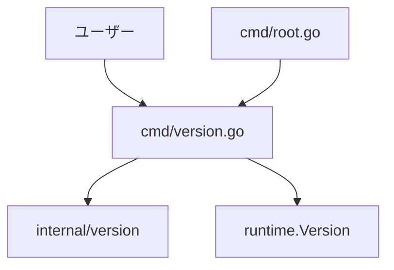

# Design Document: show-version

## Overview

`localgate version` サブコマンドを追加し、バイナリのバージョン番号・コミットハッシュ・ビルド日時・Go バージョンを標準出力に表示する機能を実装する。

**Purpose**: ユーザーが実行中の localgate バイナリのバージョンを即座に確認できるようにする。
**Users**: localgate を使用するローカル開発者が、バイナリのバージョン確認・不具合報告・サポート時に利用する。
**Impact**: 既存コマンド体系に `version` サブコマンドを追加し、`internal/version` パッケージを新設する。既存機能への変更はない。

### Goals

- `localgate version` でバージョン・コミット・ビルド日時・Go バージョンを表示する
- リリースビルド時に CI/CD が自動的にバージョン情報を注入できる
- 未注入時も `dev` / `unknown` のデフォルト値でクラッシュしない

### Non-Goals

- `--json` などの機械可読フォーマット出力（将来の拡張として検討可）
- バージョン比較や自動更新通知
- `rootCmd` の `--version` フラグへの連携（将来の拡張として検討可）

## Requirements Traceability

| Requirement | Summary | Components | Interfaces | Flows |
|-------------|---------|------------|------------|-------|
| 1.1 | version サブコマンドで情報を標準出力に表示 | VersionCmd | cobra.Command | — |
| 1.2 | 正常終了（終了コード 0） | VersionCmd | cobra.Command RunE | — |
| 1.3 | cmd/version.go に cobra コマンドとして実装 | VersionCmd | — | — |
| 2.1 | バージョン番号を表示 | VersionInfo | version.Version | — |
| 2.2 | コミットハッシュを表示 | VersionInfo | version.Commit | — |
| 2.3 | ビルド日時を表示 | VersionInfo | version.BuildDate | — |
| 2.4 | Go バージョンを表示 | VersionInfo | runtime.Version() | — |
| 2.5 | バージョン未設定時は `dev` を表示 | VersionInfo | version.Version デフォルト値 | — |
| 2.6 | コミット未設定時は `unknown` を表示 | VersionInfo | version.Commit デフォルト値 | — |
| 2.7 | ビルド日時未設定時は `unknown` を表示 | VersionInfo | version.BuildDate デフォルト値 | — |
| 3.1 | ldflags で 3 変数を上書き可能 | VersionInfo | version パッケージ変数 | — |
| 3.2 | ldflags 指定値がそのまま表示される | VersionInfo, VersionCmd | — | — |
| 3.3 | deploy.yml でタグ・コミットを自動注入 | CI/CD ワークフロー | — | — |
| 4.1 | ラベル付きテキスト形式で表示 | VersionCmd | — | — |
| 4.2 | 各項目を改行で区切る | VersionCmd | — | — |
| 4.3 | 末尾に余分な空行を含まない | VersionCmd | — | — |

## Architecture

### Architecture Pattern & Boundary Map



**Architecture Integration**:
- Selected pattern: 既存の cobra サブコマンドパターンを踏襲（Simple Addition）
- 新コンポーネント: `internal/version`（バージョン変数の格納）、`cmd/version.go`（コマンド定義）
- Steering compliance: 標準ライブラリ優先・`cmd/` に 1 コマンド 1 ファイル・`internal/` に内部ロジック

### Technology Stack

| Layer | Choice / Version | Role in Feature | Notes |
|-------|------------------|-----------------|-------|
| CLI | cobra v1.8 | サブコマンド定義・登録 | 既存依存 |
| Language | Go 1.22+ | 実装言語 | `runtime.Version()` で Go バージョン取得 |
| Build | go build -ldflags | バージョン情報注入 | `-X 'path/to/pkg.Var=value'` |
| CI/CD | GitHub Actions (`deploy.yml`) | リリース時自動注入 | `v*` タグ push で起動 |

## Components and Interfaces

| Component | Domain/Layer | Intent | Req Coverage | Key Dependencies | Contracts |
|-----------|--------------|--------|--------------|------------------|-----------|
| VersionInfo | internal/version | バージョン変数の保持・デフォルト値管理 | 2.1–2.7, 3.1, 3.2 | runtime (P0) | State |
| VersionCmd | cmd | version サブコマンド定義・出力フォーマット | 1.1–1.3, 4.1–4.3 | VersionInfo (P0) | Service |

### CLI Layer

#### VersionCmd

| Field | Detail |
|-------|--------|
| Intent | `localgate version` コマンドを定義し、バージョン情報をフォーマットして標準出力に書き出す |
| Requirements | 1.1, 1.2, 1.3, 4.1, 4.2, 4.3 |

**Responsibilities & Constraints**

- cobra コマンドの定義と `rootCmd` への登録（`init()` 経由）
- `internal/version` から取得した値をラベル付きテキスト形式でフォーマット
- 出力は `cmd.OutOrStdout()` に書き込む（テスト可能性の確保）
- エラー発生要因がないため `Run`（`RunE` 不要）で実装

**Dependencies**

- Outbound: `internal/version` — バージョン変数の参照 (P0)
- Outbound: `runtime` — Go バージョン取得 (P0)
- Inbound: `cmd/root.go` — `rootCmd.AddCommand` による登録 (P0)

**Contracts**: Service [x]

##### Service Interface

```
File: cmd/version.go

func newVersionCmd() *cobra.Command
  // cobra.Command を返す。Run で version.FormatOutput() の結果を cmd.OutOrStdout() に書き込む

func init()
  // rootCmd.AddCommand(newVersionCmd()) を呼び出す
```

- Preconditions: `internal/version` パッケージが初期化済みであること
- Postconditions: バージョン情報が標準出力に書き込まれ、終了コード 0 で返る
- Invariants: 出力は常に 4 行（末尾改行なし）

**Implementation Notes**

- `cmd.OutOrStdout()` を使用して出力先を差し替え可能にする（`commands_test.go` の既存テストパターンに合わせる）
- `Run` フィールドを使用（エラーパスがないため `RunE` 不使用）

---

#### VersionInfo

| Field | Detail |
|-------|--------|
| Intent | ldflags で上書き可能なパッケージ変数と、バージョン情報を文字列にフォーマットするロジックを提供する |
| Requirements | 2.1, 2.2, 2.3, 2.4, 2.5, 2.6, 2.7, 3.1, 3.2 |

**Responsibilities & Constraints**

- `Version`, `Commit`, `BuildDate` の 3 変数を公開パッケージ変数として宣言（`-ldflags` 注入ターゲット）
- Go バージョンは `runtime.Version()` で取得（注入不要）
- デフォルト値: `Version = "dev"`, `Commit = "unknown"`, `BuildDate = "unknown"`

**Dependencies**

- External: `runtime` — `runtime.Version()` で Go バージョン取得 (P0)

**Contracts**: State [x]

##### State Management

```
File: internal/version/version.go

Package: version

Variables (ldflags injection targets):
  var Version   = "dev"
  var Commit    = "unknown"
  var BuildDate = "unknown"

Function:
  func FormatOutput() string
    // 4 行のバージョン情報文字列を返す（末尾改行なし）
    // 出力形式:
    //   Version:    <Version>
    //   Commit:     <Commit>
    //   Build Date: <BuildDate>
    //   Go Version: <runtime.Version()>
```

- State model: パッケージ初期化時に確定する読み取り専用変数
- Persistence: なし（バイナリ埋め込みのみ）
- Concurrency strategy: 読み取り専用のため排他制御不要

**Implementation Notes**

- ldflags での上書き例: `-X 'github.com/user/localgate/internal/version.Version=v1.2.3'`
- `FormatOutput()` は `fmt.Sprintf` で構築し、末尾の `\n` を含まない形式で返す

---

### CI/CD

#### deploy.yml の更新

| Field | Detail |
|-------|--------|
| Intent | `v*` タグ push 時のビルドコマンドにバージョン情報を ldflags で注入する |
| Requirements | 3.3 |

**ldflags の構成**:

```
-ldflags "-X 'github.com/[owner]/localgate/internal/version.Version=${GITHUB_REF_NAME}' \
           -X 'github.com/[owner]/localgate/internal/version.Commit=${GITHUB_SHA}' \
           -X 'github.com/[owner]/localgate/internal/version.BuildDate=$(date -u +%Y-%m-%dT%H:%M:%SZ)'"
```

## Error Handling

### Error Strategy

`version` コマンドはユーザー入力・ネットワーク・ファイルシステムを一切使用しないため、実行時エラーは発生しない。

### Monitoring

特になし（標準出力への書き込み失敗は OS レベルの問題であり、localgate の管轄外）。

## Testing Strategy

### Unit Tests

ファイル: `cmd/version_test.go`

1. **デフォルト値の出力確認**: `Version="dev"`, `Commit="unknown"`, `BuildDate="unknown"` のとき、出力が期待フォーマットと一致する
2. **任意値の出力確認**: `version.Version`, `version.Commit`, `version.BuildDate` を設定した状態でコマンドを実行し、出力が設定値を含む
3. **Go バージョンの出力確認**: 出力に `Go Version:` ラベルが含まれ、`runtime.Version()` の値と一致する
4. **末尾空行なし確認**: 出力文字列が `\n` で終わらない

ファイル: `internal/version/version_test.go`

5. **FormatOutput の単体テスト**: 各変数を設定した状態で `FormatOutput()` の出力フォーマットを検証
