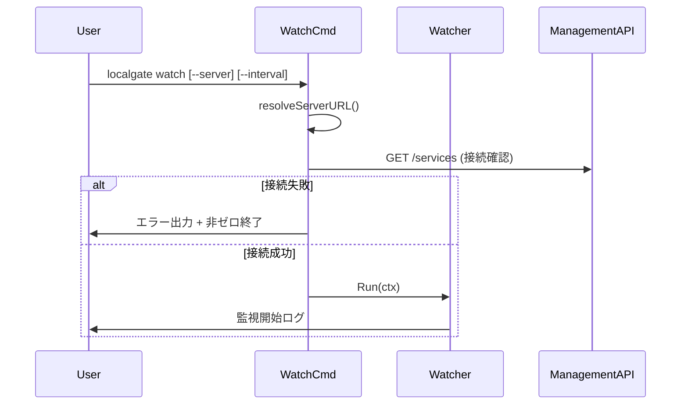
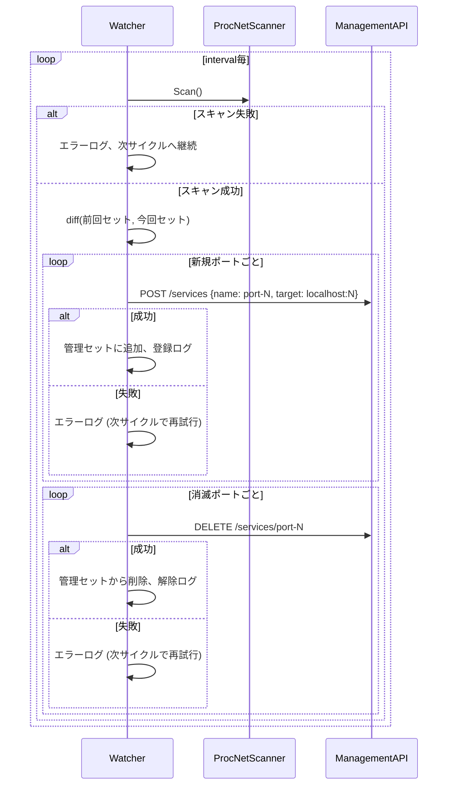
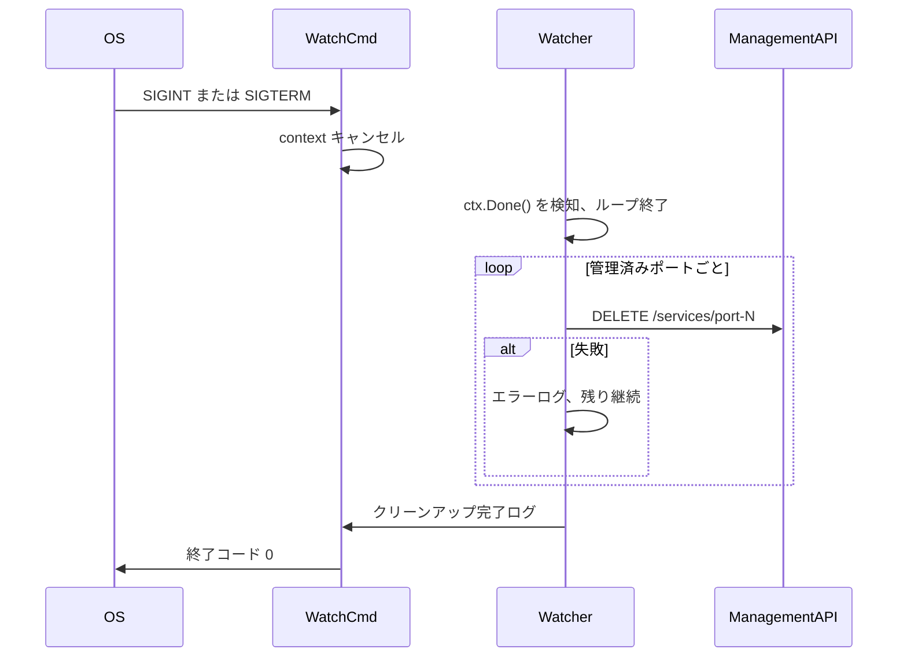

# 技術設計書: watch-port

## Overview

`watch` サブコマンドは、Linuxの `/proc/net/tcp` および `/proc/net/tcp6` を定期的に読み取り、TCPv4/v6 の LISTEN ポートの変化を検出して localgate サーバへの自動登録・解除を行う。主なユースケースはDockerコンテナ（Debian）内でのバックグラウンド実行であり、**対応プラットフォームは Linux のみ**とする。

`watch` コマンドは既存の CLI パターン（cobra + `cmd/` パッケージ）を踏襲し、ドメインロジックは新設の `internal/watcher` パッケージに分離する。ポートの監視には外部コマンドを使わず、Go 標準ライブラリのみで `/proc/net/tcp[6]` を直接パースする。

### Goals

- `localgate watch` コマンドで Linux 上のLISTENポートを継続的に監視する
- 新規LISTENポートを `port-{n}` の名前で localgate に自動登録する
REVIEW: サービス名は`{ホスト名のサブドメイン}-{port}`にしてほしい。例えばホスト名が`foobar.test`でポートが`8080`の場合、`foobar-8080`という名前にしてほしい。ホスト名が`hoge`でポートが`9999`の場合は`hoge-9999`。
- LISTENが終了したポートのサービスを自動解除する
- コマンド終了時（SIGINT/SIGTERM）に登録済みサービスをすべてクリーンアップする

### Non-Goals

- macOS / Windows のサポート
- watch 起動前から存在していたポートの登録
- ポート範囲フィルタリング等の高度なフィルター機能
- 永続化・再起動時の状態復元

## Requirements Traceability

| Requirement | Summary | Components | Interfaces | Flows |
|-------------|---------|------------|------------|-------|
| 1.1 | watch サブコマンドの提供 | WatchCmd | — | — |
| 1.2 | 起動時にサーバ接続確認 | WatchCmd, ManagementClient | `ManagementClient.Ping` | 起動フロー |
| 1.3 | 接続失敗時のエラー終了 | WatchCmd | — | 起動フロー |
| 1.4 | サーバURL解決 | WatchCmd | `resolveServerURL` | — |
| 1.5 | 監視中の状態ログ | Watcher | — | ポーリングループ |
| 2.1 | ポーリングでLISTEN一覧取得 | ProcNetScanner | `PortScanner.Scan` | ポーリングループ |
| 2.2 | デフォルト1秒間隔 | WatchCmd | — | — |
| 2.3 | `--interval` フラグ | WatchCmd | — | — |
| 2.4 | 取得失敗時の継続 | Watcher | — | ポーリングループ |
| 3.1 | 新規ポートの自動登録 | Watcher, ManagementClient | `ManagementClient.Register` | ポーリングループ |
| 3.2 | 登録成功時のログ | Watcher | — | ポーリングループ |
| 3.3 | 登録失敗時の次サイクル再試行 | Watcher | — | ポーリングループ |
| 3.4 | サービス名 `port-{n}` 形式 | Watcher | — | — |
| 3.5 | 管理済みポートセットの保持 | Watcher | State | — |
| 4.1 | 消滅ポートの自動解除 | Watcher, ManagementClient | `ManagementClient.Deregister` | ポーリングループ |
| 4.2 | 解除成功時のログ | Watcher | — | ポーリングループ |
| 4.3 | 解除失敗時の次サイクル再試行 | Watcher | — | ポーリングループ |
| 4.4 | watch管理サービスのみ対象 | Watcher | State | — |
| 5.1 | SIGINT/SIGTERM の捕捉 | WatchCmd | — | 終了フロー |
| 5.2 | 全管理サービスの解除 | Watcher | `ManagementClient.Deregister` | 終了フロー |
| 5.3 | クリーンアップ完了ログと正常終了 | Watcher | — | 終了フロー |
| 5.4 | 解除失敗でも残り継続 | Watcher | — | 終了フロー |
| 5.5 | SIGKILL以外では必ずクリーンアップ | WatchCmd | — | 終了フロー |

## Architecture

### Existing Architecture Analysis

既存の CLI は `cmd/` に cobra コマンドを配置し、`internal/` にドメインロジックを格納するパターンを採用している。クライアントコマンドの共通型 (`resolveServerURL`, `apiError` 等) は `cmd/client.go` に集約されている。`internal/watcher` から `cmd/` をインポートすると循環依存が生じるため、watcher パッケージは独自の最小 HTTP クライアントを保持する。

### Architecture Pattern & Boundary Map

```mermaid
graph TB
    subgraph cmd
        WatchCmd[watch.go WatchCmd]
        ClientGo[client.go resolveServerURL]
    end
    subgraph internal_watcher
        Watcher[watcher.go Watcher]
        ProcNetScanner[procnet.go ProcNetScanner]
        HTTPClient[client.go ManagementHTTPClient]
    end
    subgraph localgate_server
        ManagementAPI[Management API POST DELETE /services]
    end

    WatchCmd -->|生成・Run| Watcher
    WatchCmd -->|resolveServerURL| ClientGo
    Watcher -->|PortScanner.Scan| ProcNetScanner
    Watcher -->|ManagementClient.Register/Deregister| HTTPClient
    ProcNetScanner -->|読み取り| proc[/proc/net/tcp tcp6]
    HTTPClient -->|HTTP| ManagementAPI
```

**Architecture Integration**:
- 選択パターン: レイヤードアーキテクチャ（CLI層 → ドメイン層）。既存の `cmd/` → `internal/` の依存方向を維持。
- 新コンポーネント: `internal/watcher` パッケージ（`Watcher`, `ProcNetScanner`, `ManagementHTTPClient`）
- 既存パターン踏襲: `cmd/watch.go` は `newWatchCmd()` + `init()` パターン、`resolveServerURL()` の再利用

### Technology Stack

| Layer | Choice / Version | Role | Notes |
|-------|-----------------|------|-------|
| CLI | cobra v1.8 | watch サブコマンド定義 | 既存スタックと同一 |
| OS Interface | Go標準 `os`, `bufio` | `/proc/net/tcp[6]` 読み取り | Linux限定 |
| Signal Handling | Go標準 `signal.NotifyContext` | SIGINT/SIGTERM 捕捉 | Go 1.16+ |
| HTTP Client | Go標準 `net/http` | 管理APIコール | 既存スタックと同一 |
| Concurrency | Go標準 `context`, `time.Ticker` | ポーリングループ制御 | — |

## System Flows

### 起動フロー



### ポーリングループ



### 終了フロー



## Components and Interfaces

### コンポーネント一覧

| Component | Domain/Layer | Intent | Req Coverage | Key Dependencies | Contracts |
|-----------|-------------|--------|--------------|-----------------|-----------|
| WatchCmd | CLI | watchサブコマンド定義・シグナル処理 | 1.1–1.5, 2.2–2.3, 5.1, 5.5 | Watcher (P0), resolveServerURL (P0) | — |
| Watcher | internal/watcher | ポーリングループ・差分検出・クリーンアップ | 1.5, 2.1, 2.4, 3.1–3.5, 4.1–4.4, 5.2–5.4 | PortScanner (P0), ManagementClient (P0) | Service, State |
| ProcNetScanner | internal/watcher | /proc/net/tcp[6] パーサ | 2.1 | os, bufio (P0) | Service |
| ManagementHTTPClient | internal/watcher | 管理API HTTPクライアント | 1.2, 3.1, 4.1, 5.2 | net/http (P0) | Service, API |

---

### CLI 層

#### WatchCmd

| Field | Detail |
|-------|--------|
| Intent | `localgate watch` サブコマンドの定義、フラグ処理、シグナルハンドリング、Watcher の起動 |
| Requirements | 1.1, 1.2, 1.3, 1.4, 2.2, 2.3, 5.1, 5.5 |

**Responsibilities & Constraints**
- cobra コマンド定義（`cmd/watch.go`）
- `resolveServerURL()` でサーバURL解決（既存 `cmd/client.go` 関数を再利用）
- 起動時に `GET /services` で接続確認。失敗時は stderr にエラー出力し非ゼロ終了
- `signal.NotifyContext` で SIGINT/SIGTERM を受け取り context をキャンセル
- `Watcher.Run(ctx)` を呼び出し、終了を待機

**Dependencies**
- Inbound: ユーザー（CLI実行）
- Outbound: `Watcher` — ポーリングループ実行 (P0)
- External: `resolveServerURL` (`cmd/client.go`) — サーバURL解決 (P0)
- External: `net/http` — 接続確認リクエスト (P0)
- External: `signal.NotifyContext` — シグナル捕捉 (P0)

**Contracts**: なし（ドメインロジックは Watcher に委譲）

**Implementation Notes**
- Integration: `init()` 内で `rootCmd.AddCommand(newWatchCmd())` を呼ぶ（既存パターン）
- Validation: `--interval` は 1 以上の整数のみ受け付ける
- Risks: なし

---

### internal/watcher 層

#### Watcher

| Field | Detail |
|-------|--------|
| Intent | ポーリングループ、ポートセット差分検出、サービス登録・解除の制御、終了時クリーンアップ |
| Requirements | 1.5, 2.1, 2.4, 3.1–3.5, 4.1–4.4, 5.2–5.4 |

**Responsibilities & Constraints**
- `PortScanner.Scan()` を `interval` 間隔で呼び出し、前回セットとの差分を計算する
- 新規ポート: `ManagementClient.Register("port-{n}", "localhost:{n}")` を呼び出す
REVIEW: `localhost`ではなく`$(hostname)`にしてほしい。ユースケースはコンテナ内から同一ネットワークに所属している別コンテナ宛にサービス登録を行うため。
- 消滅ポート: `ManagementClient.Deregister("port-{n}")` を呼び出す
- 管理済みポートセット (`map[int]struct{}`) を内部状態として保持
- `ctx.Done()` 検知時: 管理済みポートをすべて解除してから return する
- 登録・解除の失敗はログ記録のみ行い、処理を継続する（Graceful Degradation）

**Dependencies**
- Inbound: WatchCmd — `Run(ctx)` 呼び出し
- Outbound: `PortScanner` — ポート一覧取得 (P0)
- Outbound: `ManagementClient` — サービス登録・解除 (P0)

**Contracts**: Service [x] / State [x]

##### Service Interface
```go
// Watcher はポート監視と自動登録・解除を行う。
type Watcher struct {
    scanner  PortScanner
    client   ManagementClient
    interval time.Duration
    managed  map[int]struct{} // このwatcherが登録したポートのセット
}

func NewWatcher(scanner PortScanner, client ManagementClient, interval time.Duration) *Watcher

// Run はポーリングループを開始し、ctx がキャンセルされると
// クリーンアップ後に return する。
func (w *Watcher) Run(ctx context.Context) error
```
- 事前条件: `scanner` および `client` は非 nil であること
- 事後条件: 正常終了時、`w.managed` は空であること
- 不変条件: `w.managed` には ManagementClient.Register に成功したポートのみ含まれる

##### State Management
- 状態モデル: `managed map[int]struct{}` — `Watcher` のフィールドとして保持
- 永続化: なし（インメモリのみ）
- 並行性: `Run` は単一ゴルーチンで実行される想定。外部からの並行呼び出しは非サポート

**Implementation Notes**
- Integration: 起動時のスナップショットをベースラインとする（起動前から存在するポートは管理対象外）
- Risks: watch 起動前から存在するポートは登録されない（仕様上の境界）

---

#### ProcNetScanner

| Field | Detail |
|-------|--------|
| Intent | Linux の `/proc/net/tcp` および `/proc/net/tcp6` を読み取り、LISTEN ポート番号セットを返す |
| Requirements | 2.1 |

**Responsibilities & Constraints**
- `/proc/net/tcp` と `/proc/net/tcp6` の両ファイルを開いてパースする
- `st` フィールドが `0A`（LISTEN）の行のみ対象とする
- `local_address` フィールドの `HEXIP:HEXPORT` からポート番号を抽出する（16進数デコード）
- IPv4/v6 の重複ポートは `map` で自動排除する

**Dependencies**
- External: `os.Open("/proc/net/tcp")`, `os.Open("/proc/net/tcp6")` — カーネルファイルシステム (P0)
- External: `bufio.Scanner`, `strconv.ParseUint` — パース (P0)

**Contracts**: Service [x]

##### Service Interface
```go
// PortScanner は LISTEN 状態の TCP ポート一覧を返すインターフェース。
type PortScanner interface {
    // Scan は現在 LISTEN 中の TCP ポート番号のスライスを返す。
    // 重複なし、順序不定。
    Scan() ([]int, error)
}

// ProcNetScanner は /proc/net/tcp[6] を使用する PortScanner 実装。
// Linux 専用。
type ProcNetScanner struct{}

func NewProcNetScanner() *ProcNetScanner
func (s *ProcNetScanner) Scan() ([]int, error)
```
- 事前条件: `/proc/net/tcp` および `/proc/net/tcp6` が読み取り可能であること
- 事後条件: 返却スライスに重複なし
- エラー条件: ファイルが存在しない・読み取り権限がない場合は error を返す

**Implementation Notes**
- Integration: Linux 専用実装。コンパイル時に OS 制約は設けないが、非 Linux 環境では実行時エラーになる
- Risks: `/proc/net/tcp6` が存在しない環境（IPv6 無効カーネル）ではエラーログを出力しつつ TCP4 の結果のみ返す

---

#### ManagementHTTPClient

| Field | Detail |
|-------|--------|
| Intent | localgate 管理 API への HTTP リクエスト送信（Register / Deregister / 接続確認） |
| Requirements | 1.2, 3.1, 4.1, 5.2 |

**Responsibilities & Constraints**
- `POST /services` でサービスを登録する
- `DELETE /services/{name}` でサービスを解除する
- `GET /services` で接続確認を行う（WatchCmd からの ping 用）
- `cmd/client.go` には依存しない（循環依存回避）

**Dependencies**
- External: `net/http` — HTTPクライアント (P0)
- External: `encoding/json` — リクエスト/レスポンスシリアライズ (P0)

**Contracts**: Service [x] / API [x]

##### Service Interface
```go
// ManagementClient は localgate 管理 API のクライアントインターフェース。
type ManagementClient interface {
    // Ping は管理 API への疎通確認を行う。
    Ping() error
    // Register はサービスを登録する。
    Register(name, target string) error
    // Deregister はサービスを解除する。
    // サービスが存在しない場合もエラーとせず nil を返す。
    Deregister(name string) error
}

// ManagementHTTPClient は ManagementClient の HTTP 実装。
type ManagementHTTPClient struct {
    serverURL  string
    httpClient *http.Client
}

func NewManagementHTTPClient(serverURL string) *ManagementHTTPClient
```

##### API Contract
| Method | Endpoint | Request | Response | Errors |
|--------|----------|---------|----------|--------|
| POST | /services | `{"name": string, "target": string}` | 201 Created | 409 Conflict, 500 |
| DELETE | /services/{name} | — | 204 No Content | 404 Not Found, 500 |
| GET | /services | — | 200 OK | 接続不可 |

- `Register` は 409 Conflict（既存登録）の場合も正常とみなさず error を返す（watch の冪等性保証のため）
- `Deregister` は 404 Not Found の場合は nil を返す（すでに解除済みは成功扱い）

**Implementation Notes**
- Integration: `cmd/client.go` の `registerServiceRequest` 型と同等の JSON 構造を使用するが、型定義は独立させる
- Risks: サーバが一時的に応答しない場合、Deregister 失敗が続く可能性。次サイクルで再試行する設計で対処

## Data Models

### Domain Model

- **管理済みポートセット** (`map[int]struct{}`): Watcher が登録したポート番号の集合。集約ルートは `Watcher`。
- **ポートスナップショット** (`[]int`): ポーリング各サイクルの現在 LISTEN ポート一覧。差分計算後に前回セットとして保持。
- ビジネスルール: `managed` に含まれるポートのみ解除対象。外部で登録されたサービスには干渉しない。

### Logical Data Model

| フィールド | 型 | 説明 |
|--------|----|----|
| managed | `map[int]struct{}` | 管理中のポート番号セット |
| previous | `map[int]struct{}` | 前回スキャン結果（差分計算用） |
| サービス名 | `string` | `port-{ポート番号}` 形式 |
| ターゲット | `string` | `localhost:{ポート番号}` |

## Error Handling

### Error Strategy

- **Fail Fast**: 起動時の接続確認に失敗した場合のみ即時終了
- **Graceful Degradation**: ポーリング中のスキャン失敗・API 失敗はログ記録して次サイクルへ継続
- **Cleanup First**: 終了シーケンスでは解除失敗があっても残り全件を試みる

### Error Categories and Responses

| エラー種別 | 発生箇所 | 応答 |
|----------|---------|-----|
| サーバ接続失敗 (起動時) | WatchCmd | stderr にエラー出力、非ゼロ終了 |
| `/proc/net/tcp` 読み取り失敗 | ProcNetScanner | error を Watcher へ返却 → ログ記録・次サイクル継続 |
| サービス登録失敗 (3xx-5xx) | ManagementHTTPClient | error を Watcher へ返却 → ログ記録・次サイクルで再試行 |
| サービス解除失敗 (クリーンアップ) | ManagementHTTPClient | ログ記録、残り件数の解除を継続 |

### Monitoring

- すべてのエラーは `fmt.Fprintf(os.Stderr, ...)` で標準エラー出力に記録（既存パターンに合わせ、ロギングライブラリは未使用）
- 登録・解除の成功は標準出力に記録

## Testing Strategy

### Unit Tests

- `ProcNetScanner.Scan()`: テスト用の擬似 `/proc/net/tcp` 内容（文字列リーダー）を渡し、正しいポートセットが返ることを検証
- `Watcher` の差分ロジック: `PortScanner` と `ManagementClient` をモックし、新規/消滅ポートに対して正しい Register/Deregister が呼ばれることを検証
- `Watcher.Run` のクリーンアップ: context をキャンセルした際、managed ポートがすべて Deregister されることを検証
- `ManagementHTTPClient.Register/Deregister`: `httptest.Server` を使い、正しいエンドポイント・メソッドでリクエストが送られることを検証

### Integration Tests

- `watch` コマンドのエンドツーエンド: `httptest.Server` で管理 API を模擬し、ポートスキャン結果を制御できる `PortScanner` モックを注入して、登録・解除・クリーンアップのシナリオを検証

## Performance & Scalability

デフォルト1秒ポーリングは `/proc/net/tcp` の1ファイル読み取りであり、ほぼゼロのCPU/メモリコスト。開発環境用途（数十ポート程度）では性能上の懸念はない。
